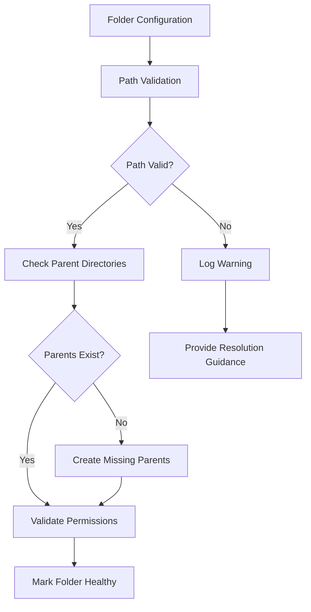
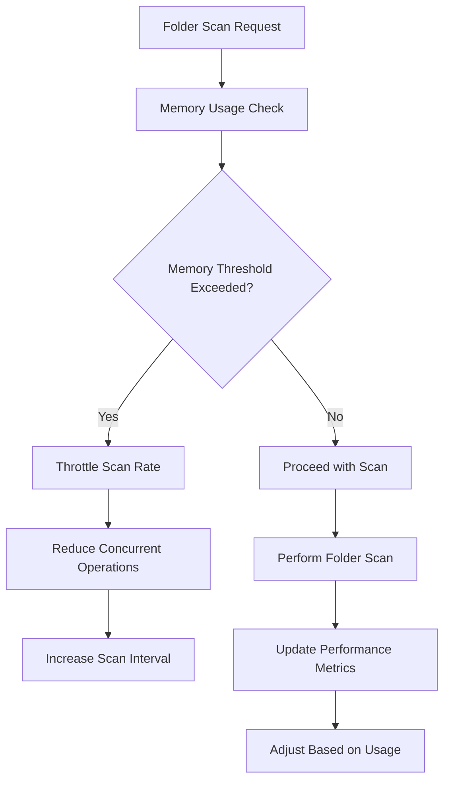
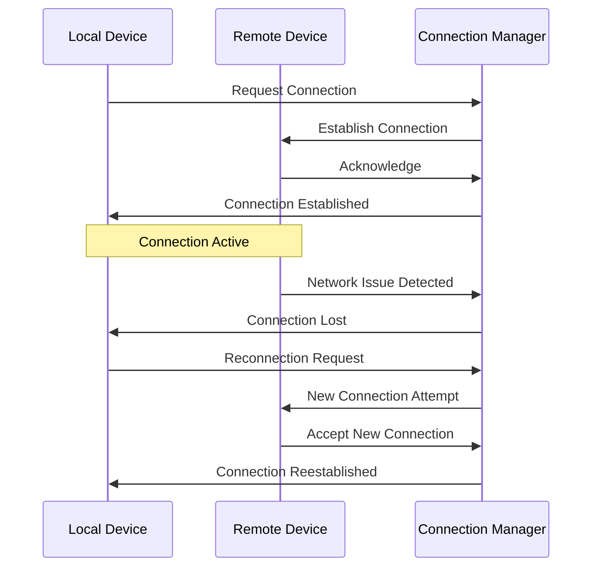
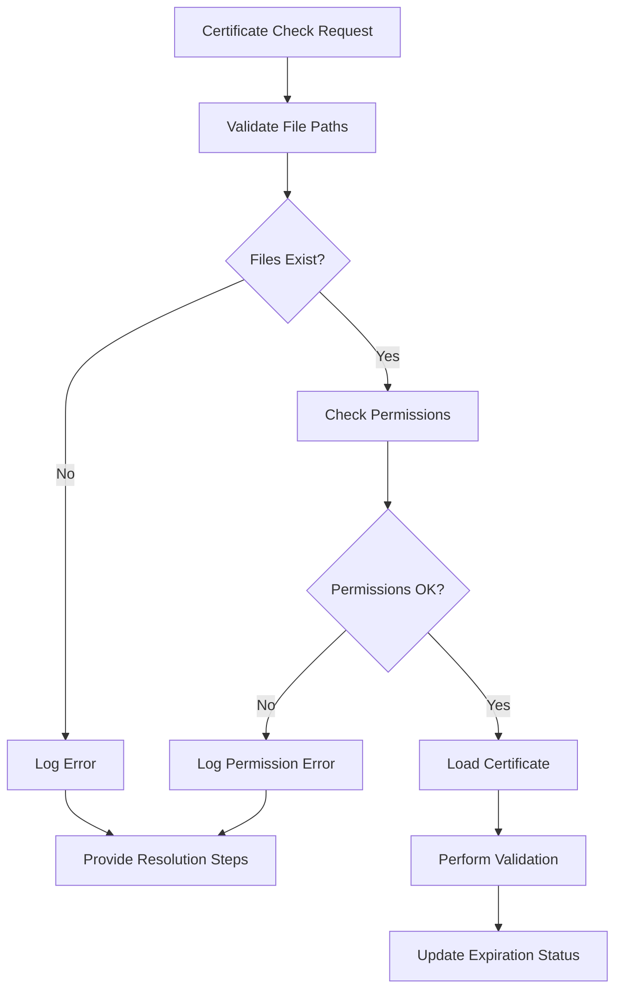

# Syncthing Log Analysis and System Health Design

## 1. Overview

This document analyzes a Syncthing v2.0.7 log output and provides design recommendations for addressing the identified issues. The log shows several critical problems including folder path validation errors, high memory usage warnings, and connection instability between devices.

The main issues identified in the log are:
1. **Folder Path Issues**: Multiple folders have invalid characters and case sensitivity problems
2. **High Memory Usage**: Several folders are consuming excessive memory (over 10GB)
3. **Connection Instability**: Repeated connection establishment and loss between devices
4. **Certificate Validation Failures**: Issues with certificate loading for HTTPS

## 2. Architecture

Syncthing follows a decentralized peer-to-peer architecture where each device can act as both a client and server. The system consists of:

1. **Core Components**:
   - Configuration management
   - Folder synchronization engine
   - Connection management
   - Device discovery mechanisms
   - REST API and Web GUI

2. **Data Flow**:
   - Configuration is loaded at startup
   - Devices establish connections using multiple protocols (TCP, QUIC)
   - Folders are scanned for changes periodically
   - Files are synchronized using the block exchange protocol

3. **Key Services**:
   - Certificate Manager: Handles TLS certificates
   - Connection Service: Manages device connections
   - Model Service: Coordinates folder synchronization
   - Discovery Service: Facilitates device discovery

## 3. Issues Analysis and Solutions

### 3.1 Folder Path Validation Issues

#### Problem
The logs show repeated warnings about folder paths containing invalid characters and mixed case issues:
```
WRN Folder path validation issue folder "Desktop" (2cuhx-wiqrs) issue Folder path contains invalid characters: D:\Syncthing\Desktop action Remove invalid characters from folder path
WRN Folder path validation issue folder "Desktop" (2cuhx-wiqrs) issue Folder path contains mixed case, which may cause issues on case-sensitive filesystems action Use consistent case in folder path
```

#### Root Cause
1. Invalid characters in folder paths (likely due to special characters or improper escaping)
2. Mixed case paths that may cause issues on case-sensitive filesystems
3. Non-existent parent directories in the path structure

#### Solution Design



**Implementation Steps**:
1. Enhanced path validation during folder configuration:
   - Check for invalid characters (`<>:|?*"`)
   - Validate path length limits
   - Check for case sensitivity issues
2. Detailed error reporting with actionable guidance
3. Automatic parent directory creation when missing
4. Improved folder health monitoring

### 3.2 High Memory Usage Issues

#### Problem
Multiple folders are consuming excessive memory (10GB+):
```
WRN High memory usage detected for folder (folder=2cuhx-wiqrs memoryBytes=10453852160)
```

#### Root Cause
1. Large folder scanning operations consuming memory
2. Inefficient memory management during file indexing
3. Possible memory leaks in folder scanning processes

#### Solution Design



**Implementation Steps**:
1. Implement memory pressure monitoring for each folder
2. Dynamic scan interval adjustment based on memory usage
3. Limit concurrent folder operations when memory is constrained
4. Enhanced garbage collection triggers during high memory usage
5. Detailed memory usage reporting in health metrics

### 3.3 Connection Instability Issues

#### Problem
Repeated connection establishment and loss between devices:
```
INF Established secure connection (device=HYGSE4S ...)
INF Lost device connection (kind=primary device=HYGSE4S ...) error="replacing connection"
```

#### Root Cause
1. Multiple connection attempts from the same device
2. Connection priority conflicts causing replacement
3. Network instability or firewall issues

#### Solution Design



**Implementation Steps**:
1. Enhanced connection health monitoring
2. Improved connection replacement logic to minimize disruptions
3. Better error handling and logging for connection issues
4. Connection stability metrics and reporting
5. Adaptive reconnection strategies based on failure patterns

### 3.4 Certificate Validation Issues

#### Problem
Failed to load certificates for expiration checks:
```
WRN Failed to load certificate for expiration check (file=D:\SyncthingtrayPortable\Data\Configuration\cert.pem error="open D:\\SyncthingtrayPortable\\Data\\Configuration\\cert.key: O sistema não pode encontrar o arquivo especificado.")
```

#### Root Cause
1. Missing certificate key files
2. Incorrect file paths in configuration
3. Permission issues accessing certificate files

#### Solution Design



**Implementation Steps**:
1. Enhanced certificate file validation
2. Detailed error reporting with resolution guidance
3. Automatic certificate regeneration when missing
4. Improved certificate management in the GUI
5. Better handling of certificate loading failures

## 4. Data Models

### 4.1 Folder Health Status Model

```go
type FolderHealthStatus struct {
    FolderID         string    `json:"folderID"`
    Healthy          bool      `json:"healthy"`
    PathExists       bool      `json:"pathExists"`
    PermissionsOK    bool      `json:"permissionsOK"`
    MarkerFound      bool      `json:"markerFound"`
    Issues           []string  `json:"issues"`
    DiscoveryIssues  []string  `json:"discoveryIssues"`
    LastChecked      time.Time `json:"lastChecked"`
    CPUUsagePercent  float64   `json:"cpuUsagePercent"`
    MemoryUsageBytes uint64    `json:"memoryUsageBytes"`
}
```

### 4.2 Connection Health Model

```go
type ConnectionHealth struct {
    DeviceID            protocol.DeviceID `json:"deviceID"`
    Connected           bool              `json:"connected"`
    ConnectionType      string            `json:"connectionType"`
    Address             string            `json:"address"`
    Latency             time.Duration     `json:"latency"`
    LastSeen            time.Time         `json:"lastSeen"`
    ConnectionAttempts  int               `json:"connectionAttempts"`
    SuccessfulConnections int             `json:"successfulConnections"`
    FailedConnections   int               `json:"failedConnections"`
    LastError           string            `json:"lastError"`
    LastErrorTime       time.Time         `json:"lastErrorTime"`
}
```

### 4.3 Certificate Health Model

```go
type CertificateHealth struct {
    FilePath           string    `json:"filePath"`
    Valid              bool      `json:"valid"`
    ExpirationDate     time.Time `json:"expirationDate"`
    DaysUntilExpiration int      `json:"daysUntilExpiration"`
    LoadError          string    `json:"loadError"`
    LastChecked        time.Time `json:"lastChecked"`
}
```

## 5. Business Logic Layer

### 5.1 Folder Health Monitoring

The folder health monitoring system performs regular checks on each configured folder to ensure it's properly configured and functioning:

1. **Path Validation**:
   - Verify folder path exists
   - Check for invalid characters
   - Validate case sensitivity issues
   - Confirm parent directories exist

2. **Permission Validation**:
   - Test read permissions
   - Test write permissions
   - Verify marker file access

3. **Resource Usage Monitoring**:
   - Track CPU usage per folder
   - Monitor memory consumption
   - Report excessive resource usage

4. **Health Status Reporting**:
   - Aggregate all checks into health status
   - Provide actionable error messages
   - Emit events for GUI updates

### 5.2 Connection Management

The connection management system handles device connections with improved stability:

1. **Connection Establishment**:
   - Multiple protocol support (TCP, QUIC)
   - Connection priority management
   - Network type detection (LAN/WAN)

2. **Health Monitoring**:
   - Latency tracking
   - Error rate monitoring
   - Connection stability metrics

3. **Failure Handling**:
   - Automatic reconnection
   - Exponential backoff
   - Error pattern analysis

### 5.3 Certificate Management

The certificate management system ensures secure communications:

1. **Certificate Loading**:
   - File existence validation
   - Permission checking
   - Certificate parsing

2. **Expiration Monitoring**:
   - Regular expiration checks
   - Advance warning system
   - Automatic renewal triggers

3. **Error Handling**:
   - Detailed error reporting
   - Recovery mechanisms
   - User guidance

## 6. API Endpoints Reference

### 6.1 Folder Health Endpoints

#### GET /rest/folder/health
Retrieve health status for all folders

**Response**:
```json
{
  "folders": [
    {
      "folderID": "2cuhx-wiqrs",
      "healthy": false,
      "pathExists": true,
      "permissionsOK": true,
      "markerFound": true,
      "issues": [
        "Folder path contains invalid characters: D:\\Syncthing\\Desktop",
        "Folder path contains mixed case, which may cause issues on case-sensitive filesystems"
      ],
      "discoveryIssues": [
        "Folder path contains invalid characters: D:\\Syncthing\\Desktop",
        "Folder path contains mixed case, which may cause issues on case-sensitive filesystems"
      ],
      "lastChecked": "2025-09-05T17:44:56Z",
      "cpuUsagePercent": 87.35,
      "memoryUsageBytes": 10578137088
    }
  ]
}
```

#### GET /rest/folder/health/{folderID}
Retrieve health status for a specific folder

**Response**:
```json
{
  "folderID": "2cuhx-wiqrs",
  "healthy": false,
  "pathExists": true,
  "permissionsOK": true,
  "markerFound": true,
  "issues": [
    "Folder path contains invalid characters: D:\\Syncthing\\Desktop",
    "Folder path contains mixed case, which may cause issues on case-sensitive filesystems"
  ],
  "discoveryIssues": [
    "Folder path contains invalid characters: D:\\Syncthing\\Desktop",
    "Folder path contains mixed case, which may cause issues on case-sensitive filesystems"
  ],
  "lastChecked": "2025-09-05T17:44:56Z",
  "cpuUsagePercent": 87.35,
  "memoryUsageBytes": 10578137088
}
```

### 6.2 Connection Health Endpoints

#### GET /rest/system/connections/health
Retrieve health status for all device connections

**Response**:
```json
{
  "connections": [
    {
      "deviceID": "HYGSE4S",
      "connected": true,
      "connectionType": "quic-server",
      "address": "[::]:22000-192.168.1.19:22000",
      "latency": "15ms",
      "lastSeen": "2025-09-05T17:44:56Z",
      "connectionAttempts": 25,
      "successfulConnections": 10,
      "failedConnections": 15,
      "lastError": "replacing connection",
      "lastErrorTime": "2025-09-05T17:44:56Z"
    }
  ]
}
```

### 6.3 Certificate Health Endpoints

#### GET /rest/system/certificates/health
Retrieve health status for all certificates

**Response**:
```json
{
  "certificates": [
    {
      "filePath": "D:\\SyncthingtrayPortable\\Data\\Configuration\\cert.pem",
      "valid": false,
      "expirationDate": "0001-01-01T00:00:00Z",
      "daysUntilExpiration": 0,
      "loadError": "open D:\\SyncthingtrayPortable\\Data\\Configuration\\cert.key: O sistema não pode encontrar o arquivo especificado.",
      "lastChecked": "2025-09-05T17:41:55Z"
    }
  ]
}
```

## 7. Middleware & Interceptors

### 7.1 Health Monitoring Middleware

Intercepts folder operations to track resource usage and performance metrics:

1. **Resource Tracking**:
   - CPU usage monitoring
   - Memory consumption tracking
   - I/O performance metrics

2. **Error Interception**:
   - Capture and log folder-related errors
   - Classify error types for reporting
   - Trigger health checks on errors

### 7.2 Connection Stability Middleware

Monitors connection quality and stability:

1. **Latency Monitoring**:
   - Track connection latency
   - Detect latency spikes
   - Report unstable connections

2. **Error Pattern Analysis**:
   - Identify recurring connection issues
   - Classify error types
   - Trigger adaptive responses

## 8. Testing

### 8.1 Unit Tests

#### Folder Health Tests
```go
func TestFolderPathValidation(t *testing.T) {
    // Test cases for invalid characters
    // Test cases for case sensitivity
    // Test cases for missing parent directories
}

func TestFolderMemoryUsage(t *testing.T) {
    // Test memory usage tracking
    // Test high memory detection
    // Test throttling mechanisms
}
```

#### Connection Stability Tests
```go
func TestConnectionReplacement(t *testing.T) {
    // Test connection replacement logic
    // Test priority-based connection selection
    // Test connection stability metrics
}
```

#### Certificate Management Tests
```go
func TestCertificateLoading(t *testing.T) {
    // Test certificate file validation
    // Test missing file handling
    // Test permission error handling
}
```

### 8.2 Integration Tests

#### End-to-End Folder Health Tests
```go
func TestFolderHealthMonitoring(t *testing.T) {
    // Test complete folder health check workflow
    // Test health status reporting
    // Test GUI updates
}
```

#### Connection Management Tests
```go
func TestConnectionStability(t *testing.T) {
    // Test connection establishment and maintenance
    // Test reconnection strategies
    // Test health metrics reporting
}
```

### 8.3 Performance Tests

#### Memory Usage Tests
```go
func TestHighMemoryFolderOperations(t *testing.T) {
    // Test memory usage with large folders
    // Test throttling effectiveness
    // Test garbage collection triggers
}
```

#### Connection Performance Tests
```go
func TestConnectionHandlingUnderLoad(t *testing.T) {
    // Test connection management with many devices
    // Test reconnection performance
    // Test error handling scalability
}
```


