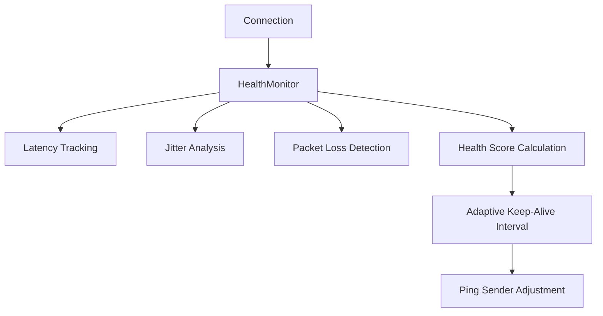
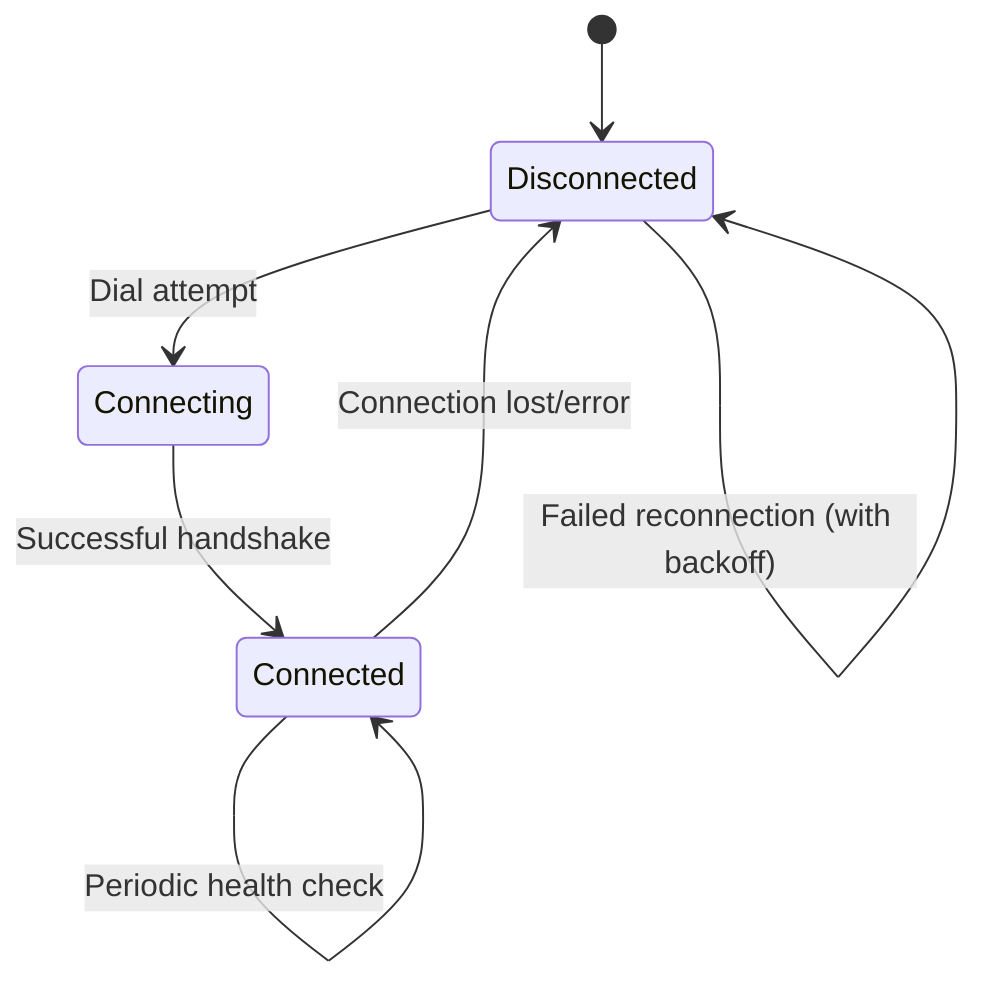

# Connection Loss Detection and Persistent Connection Maintenance Design

> **Note**: This design follows the Test-Driven Development (TDD) approach established in the existing Syncthing codebase and prioritizes comprehensive testing before implementation.

## 1. Overview

This document describes the design for detecting connection loss in Syncthing and implementing mechanisms to maintain persistent connections between devices. The solution focuses on improving connection reliability through enhanced monitoring, adaptive keep-alive mechanisms, and automatic reconnection strategies.

Syncthing is a continuous file synchronization program that emphasizes data safety, security, and ease of use. It operates in a decentralized manner without relying on central servers. Maintaining stable connections between devices is critical for ensuring reliable file synchronization.

## 2. Current Architecture Analysis

### 2.1 Connection Management Components

The Syncthing connection system consists of several key components:

1. **Connection Service** (`lib/connections/service.go`): 
   - Manages all device connections
   - Handles connection establishment and maintenance
   - Implements dialing logic for connecting to remote devices

2. **Protocol Layer** (`lib/protocol/protocol.go`):
   - Implements the BEP (Block Exchange Protocol)
   - Handles connection lifecycle including ping/pong mechanisms
   - Manages message exchange between devices

3. **Model Layer** (`lib/model/model.go`):
   - Manages the high-level connection state
   - Handles connection events (addition, closure)
   - Coordinates with the connection service

4. **Health Monitoring** (`lib/connections/health_monitor.go`):
   - Tracks connection health metrics
   - Calculates adaptive keep-alive intervals based on network conditions

### 2.2 Existing Connection Loss Detection

The current system detects connection loss through:

1. **Ping Mechanism**: 
   - The `pingSender()` function sends periodic ping messages
   - The `pingReceiver()` function monitors for incoming messages
   - If no message is received within `ReceiveTimeout` (300 seconds), the connection is closed with `ErrTimeout`

2. **Connection Closure Handling**:
   - When a connection is closed, the `Closed()` method in the model is called
   - This triggers cleanup of connection state and scheduling of reconnection attempts

### 2.3 Identified Issues

1. **Fixed Timeout Values**: The 300-second receive timeout may be too long for detecting connection loss in unstable networks
2. **Limited Health Monitoring**: Basic ping/pong mechanism doesn't account for network quality variations
3. **Inefficient Reconnection**: Simple reconnection logic without intelligent backoff or priority adjustments
4. **No Proactive Connection Maintenance**: Connections are only maintained reactively after loss is detected

## 3. Proposed Solution Architecture

### 3.1 Enhanced Connection Health Monitoring



### 3.2 Connection State Management



## 4. Detailed Design

### 4.1 Enhanced Health Monitoring System

The health monitoring system follows the existing patterns established in the codebase, particularly the `HealthMonitor` implementation in `lib/connections/health_monitor.go` which already provides foundational functionality for adaptive keep-alive intervals.

#### 4.1.1 Health Metrics Collection

The enhanced health monitoring system will collect three key metrics:

1. **Latency**: Time for round-trip message exchange
2. **Jitter**: Variation in latency measurements
3. **Packet Loss**: Detection of missing responses

#### 4.1.2 Health Score Calculation

The health score will be calculated using weighted metrics:
- Latency Weight: 50%
- Jitter Weight: 30%
- Packet Loss Weight: 20%

Formula:
```
HealthScore = ((normalizedLatency * 0.5) + (normalizedJitter * 0.3) + (normalizedPacketLoss * 0.2)) * 100
```

This approach aligns with the existing implementation patterns in the codebase where weighted metrics are used for decision making.

#### 4.1.3 Adaptive Keep-Alive Intervals

Based on the health score, the system will adjust keep-alive intervals:
- Health Score 80-100: 120 seconds between pings
- Health Score 60-79: 60 seconds between pings
- Health Score 40-59: 30 seconds between pings
- Health Score 20-39: 15 seconds between pings
- Health Score 0-19: 5 seconds between pings

This builds upon the existing adaptive keep-alive functionality that is already configurable through the `AdaptiveKeepAliveEnabled`, `AdaptiveKeepAliveMinS`, and `AdaptiveKeepAliveMaxS` options in the configuration.

### 4.2 Proactive Connection Maintenance

Building on the existing ping sender/receiver mechanisms in `lib/protocol/protocol.go`, we will enhance connection maintenance capabilities.

#### 4.2.1 Connection Heartbeat Enhancement

The existing ping mechanism will be enhanced with:

1. **Bidirectional Health Checks**: Both ends of the connection actively monitor each other
2. **Adaptive Ping Frequency**: Based on calculated health scores
3. **Early Warning System**: Detect degradation before complete loss

This enhancement extends the existing `pingSender()` and `pingReceiver()` functions which already implement basic periodic ping functionality.

#### 4.2.2 Connection Quality Assessment

Continuous monitoring of:
- Round-trip time variations
- Message delivery success rate
- Connection stability indicators

This aligns with the existing metrics collection patterns in the codebase and extends them with more sophisticated analysis.

### 4.3 Intelligent Reconnection Strategy

The reconnection strategy will enhance the existing connection loop mechanism in `lib/connections/service.go` which already implements basic reconnection logic.

#### 4.3.1 Exponential Backoff with Jitter

Reconnection attempts will follow an exponential backoff strategy:
- First attempt: Immediate
- Second attempt: 1 second
- Third attempt: 4 seconds
- Fourth attempt: 16 seconds
- Maximum backoff: 60 seconds

With jitter added to prevent thundering herd problems.

This builds upon the existing `nextDialRegistry` mechanism that already tracks reconnection timing.

#### 4.3.2 Priority-Based Connection Selection

When multiple connection addresses are available:
1. Prefer connections with better health scores
2. Consider network type (LAN vs WAN)
3. Factor in historical connection success rates

This extends the existing priority-based dialing logic that is already implemented in the connection service.

### 4.4 Multipath Connection Support

For devices with multiple network interfaces, we will extend the existing multipath functionality that is already partially implemented in the codebase.

The codebase already includes:
- Multipath configuration option (`multipathEnabled`)
- Packet scheduler implementation (`PacketScheduler`)
- Multipath connection tests

#### 4.4.1 Connection Redundancy
- Maintain multiple simultaneous connections to the same device
- Automatically failover to healthy connections when primary degrades

#### 4.4.2 Load Balancing
- Distribute traffic across multiple connections
- Monitor individual connection health for optimal routing

This enhancement will complete the multipath functionality that has already been partially implemented, following the existing architectural patterns.

## 5. Implementation Plan

Following the Test-Driven Development (TDD) approach, we will implement the solution in phases with comprehensive testing at each stage.

### 5.1 Phase 1: Enhanced Health Monitoring

1. **Testing First**:
   - Create unit tests for health score calculation algorithm
   - Implement tests for adaptive interval adjustments
   - Add integration tests for health metrics collection

2. **Implementation**:
   - Extend the `HealthMonitor` class with additional metrics collection
   - Implement health score calculation algorithm
   - Integrate adaptive keep-alive interval adjustments

### 5.2 API Endpoints and Data Models

### 6.1 Connection Status API

Enhanced connection status information will be available through existing APIs:

```json
{
  "connectionStatus": {
    "device1": {
      "connected": true,
      "address": "tcp://192.168.1.100:22000",
      "type": "tcp-client",
      "latency": "25ms",
      "healthScore": 92,
      "lastSeen": "2025-04-05T10:30:00Z"
    }
  }
}
```

### 6.2 Health Metrics Data Model

```go
type ConnectionHealth struct {
    DeviceID       protocol.DeviceID `json:"deviceID"`
    Latency        time.Duration     `json:"latency"`
    Jitter         time.Duration     `json:"jitter"`
    PacketLoss     float64           `json:"packetLoss"`
    HealthScore    float64           `json:"healthScore"`
    LastCheck      time.Time         `json:"lastCheck"`
    ConnectionType string            `json:"connectionType"`
}
```

## 7. Configuration Options

### 5.3 Phase 2: Proactive Connection Maintenance

1. **Testing First**:
   - Create unit tests for early warning detection mechanisms
   - Implement tests for connection quality assessment
   - Add integration tests for proactive maintenance features

2. **Implementation**:
   - Enhance the ping sender/receiver mechanisms
   - Implement early warning detection for connection degradation
   - Add connection quality assessment capabilities

### 5.4 Phase 3: Intelligent Reconnection

1. **Testing First**:
   - Create unit tests for exponential backoff with jitter
   - Implement tests for priority-based connection selection
   - Add integration tests for reconnection logic

2. **Implementation**:
   - Implement exponential backoff with jitter for reconnection attempts
   - Add priority-based connection selection logic
   - Improve connection status tracking and reporting

### 5.5 Phase 4: Multipath Support

1. **Testing First**:
   - Create unit tests for multipath connection management
   - Implement tests for failover mechanisms
   - Add integration tests for load balancing capabilities

2. **Implementation**:
   - Extend connection management to support multiple simultaneous connections
   - Implement failover mechanisms
   - Add load balancing capabilities

### 7.1 Adaptive Keep-Alive Settings

New configuration options in `config.xml`:

```xml
<options>
  <adaptiveKeepAliveEnabled>true</adaptiveKeepAliveEnabled>
  <adaptiveKeepAliveMinS>5</adaptiveKeepAliveMinS>
  <adaptiveKeepAliveMaxS>120</adaptiveKeepAliveMaxS>
</options>
```

### 7.2 Multipath Configuration

```xml
<options>
  <multipathEnabled>true</multipathEnabled>
</options>
```

## 8. Testing Strategy

Following the Test-Driven Development (TDD) approach established in the existing codebase, we will implement comprehensive tests before any functional code.

### 8.1 Unit Tests

1. Health score calculation accuracy
2. Adaptive interval adjustments
3. Connection degradation detection
4. Reconnection logic with backoff
5. Health monitor metrics collection
6. Packet scheduler functionality

### 8.2 Integration Tests

1. Network partition simulation
2. Latency and packet loss scenarios
3. Multipath failover testing
4. Connection recovery after outages
5. Health monitoring integration with connection service
6. Adaptive keep-alive interval adjustments in real scenarios

### 8.3 Performance Tests

1. Impact of health monitoring on CPU usage
2. Memory consumption with multiple connections
3. Network overhead of enhanced ping mechanisms
4. Scalability with multiple devices
5. Resource usage under high connection load

## 9. Security Considerations

1. **Encryption**: All enhanced monitoring traffic will use existing TLS encryption, consistent with the security model that ensures end-to-end encryption for all communication
2. **Authentication**: No changes to existing device authentication mechanisms, maintaining the existing device ID-based authentication
3. **DoS Prevention**: Rate limiting on health check requests to prevent resource exhaustion
4. **Privacy**: No additional personal data collection, maintaining the privacy-focused approach of Syncthing

## 10. Monitoring and Observability

### 10.1 Metrics Collection

New Prometheus metrics for:
- Connection health scores
- Reconnection attempts
- Failover events
- Connection quality trends

These metrics will follow the existing metrics patterns established in the codebase (e.g., in `lib/protocol/metrics.go` and `lib/connections/metrics.go`).

### 10.2 Logging

Enhanced logging for:
- Connection degradation events
- Health score changes
- Automatic reconnection triggers
- Failover activities

Logging will follow the existing structured logging approach using `slog` that is used throughout the Syncthing codebase.

## 11. Backward Compatibility

The solution maintains full backward compatibility following the established patterns in the Syncthing project:
- Devices without enhanced health monitoring will continue to work normally
- Adaptive keep-alive can be disabled to revert to fixed intervals
- All new features are opt-in through configuration
- Existing configuration files will continue to work without modification
- Older Syncthing versions can still connect to enhanced versions (graceful degradation)