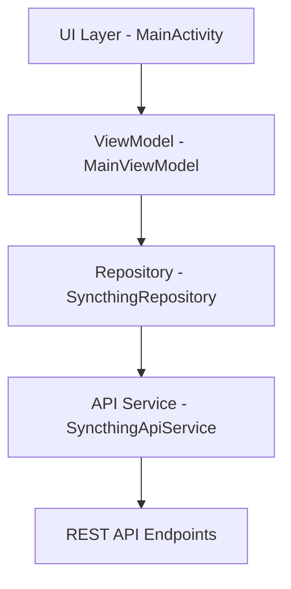

# Android APK Creation and Compilation Design

## Overview

This document outlines the design for creating and compiling a fully functional Android APK for the Syncthing application. The Android app serves as a mobile interface to the Syncthing backend through its REST API, following the implementation plan detailed in `ANDROID_IMPLEMENTATION_PLAN.md`.

The Android application follows the MVVM architecture pattern with clean separation between data, UI, and business logic layers, using the repository pattern for data abstraction.

## Architecture

### Component Structure



### Project Structure

```
syncthing/
├── android/
│   ├── app/
│   │   ├── src/main/java/com/syncthing/android/
│   │   │   ├── data/
│   │   │   │   ├── api/
│   │   │   │   │   ├── SyncthingApiService.kt
│   │   │   │   │   └── model/
│   │   │   │   │       └── SystemStatus.kt
│   │   │   │   └── repository/
│   │   │   │       └── SyncthingRepository.kt
│   │   │   ├── viewmodel/
│   │   │   │   └── MainViewModel.kt
│   │   │   └── MainActivity.kt
│   │   ├── src/main/res/
│   │   │   ├── layout/
│   │   │   │   └── activity_main.xml
│   │   │   └── values/
│   │   └── build.gradle
│   ├── build.gradle
│   └── settings.gradle
└── lib/
    └── api/
        └── constants.go
```

## Build Process

### Prerequisites

1. Android SDK with API level 34 (Android 14)
2. JDK 11 or higher
3. Gradle 8.0.2
4. Kotlin 1.9.0

### Build Configuration

#### Root Build Configuration (`android/build.gradle`)

- Kotlin version: 1.9.0
- Compile SDK version: 34
- Minimum SDK version: 21
- Target SDK version: 34

#### App Build Configuration (`android/app/build.gradle`)

Key dependencies:
- AndroidX Core: 1.10.1
- AppCompat: 1.6.1
- Material Design: 1.9.0
- Lifecycle components (ViewModel, LiveData): 2.6.1
- Retrofit2 (Networking): 2.9.0
- Room (Database): 2.5.0

Build features:
- ViewBinding enabled
- Kotlin JVM target: 1.8

### Build Commands

To compile the Android APK:

```bash
# Navigate to the Android directory
cd android

# Build the debug APK
./gradlew assembleDebug

# Build the release APK
./gradlew assembleRelease

# Build and install on a connected device
./gradlew installDebug
```

## API Integration

### Shared Constants

The Android app shares API endpoints with the desktop version through `lib/api/constants.go`, ensuring synchronization when APIs change.

Key endpoints:
- System status: `/rest/system/status`
- System configuration: `/rest/system/config`
- System connections: `/rest/system/connections`
- Database status: `/rest/db/status`
- Events: `/rest/events`

### Data Models

The `SystemStatus` model represents the response from the `/rest/system/status` endpoint:

```kotlin
data class SystemStatus(
    val alloc: Long,
    val cpuPercent: Double,
    val discoveryEnabled: Boolean,
    val discoveryErrors: Map<String, String>,
    val discoveryMethods: Int,
    val goroutines: Int,
    val myID: String,
    val pathSeparator: String,
    val startTime: String,
    val sys: Long,
    val tilde: String,
    val uptime: Int
)
```

### Repository Pattern

The `SyncthingRepository` class abstracts data access:

```kotlin
class SyncthingRepository(private val apiService: SyncthingApiService) {
    suspend fun getSystemStatus(apiKey: String): SystemStatus {
        return apiService.getSystemStatus(apiKey)
    }
}
```

### API Service

The `SyncthingApiService` interface defines REST endpoints using Retrofit:

```kotlin
interface SyncthingApiService {
    @GET("/rest/system/status")
    suspend fun getSystemStatus(@Header("X-API-Key") apiKey: String): SystemStatus
}
```

## UI Architecture

### MVVM Pattern

The application follows the Model-View-ViewModel pattern:

- **Model**: Repository and data classes
- **View**: MainActivity and layout files
- **ViewModel**: MainViewModel handling UI logic

### Main Activity

The `MainActivity` serves as the entry point, displaying a simple UI with the text "Syncthing Android".

### ViewModel

The `MainViewModel` handles:
- Loading state management
- API calls through the repository
- Exposing data to the UI via LiveData

## Testing Strategy

### Unit Tests

Located in `android/app/src/test/`:

1. `SyncthingRepositoryTest` - Tests repository functionality with mocked API service
2. `MainViewModelTest` - Tests ViewModel behavior with mocked repository

Testing frameworks:
- JUnit 4.13.2
- Mockito for mocking
- Kotlin Coroutines Test for async operations

### Test Execution

```bash
# Run unit tests
./gradlew test
```

## Security Considerations

1. **Network Security**: The app uses `android:usesCleartextTraffic="true"` which should be reviewed for production.
2. **API Keys**: API keys are passed via headers and should be securely stored.
3. **Permissions**: Minimal permissions requested (INTERNET, ACCESS_NETWORK_STATE, POST_NOTIFICATIONS).

## Deployment

### Release Build Process

1. Update version code and name in `app/build.gradle`
2. Generate signed APK with release key
3. Distribute through Google Play Store or direct APK installation

### Version Management

Version information is managed in `app/build.gradle`:
- versionCode: 1 (increment for each release)
- versionName: "1.0" (semantic versioning)

## Integration with Desktop Version

The Android app maintains compatibility with the desktop version through:
1. Shared API constants in `lib/api/constants.go`
2. Consistent REST API endpoints
3. Coordinated release cycles

When updating the desktop version:
1. Update shared constants if API endpoints change
2. Update Android app to use new APIs
3. Test both platforms together
4. Release both versions simultaneously

## Troubleshooting

Common build issues:
1. **Missing SDK**: Ensure Android SDK with API 34 is installed
2. **JDK Issues**: Verify JDK 11+ is installed and configured
3. **Dependency Resolution**: Check internet connectivity for Gradle dependencies
4. **Permission Errors**: Ensure proper file permissions for build tools

## Future Enhancements

1. Implement full feature set matching the web UI
2. Add local database caching with Room
3. Implement push notifications for sync events
4. Add biometric authentication for API key protection
5. Implement offline mode with local data storage