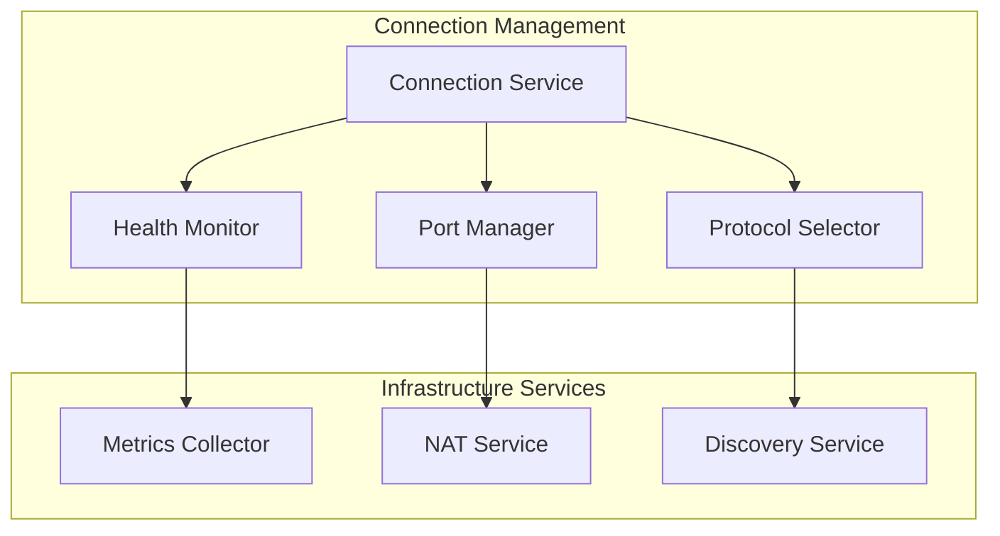

# Network Connection Stability Enhancement Design

## 1. Overview

This document outlines the design for improving network connection stability in Syncthing and implementing random port usage to address frequent connection losses. The design focuses on:

1. Reducing connection churn by improving connection quality assessment
2. Implementing random port selection to avoid port conflicts
3. Enhancing connection management with better replacement policies
4. Improving health monitoring for proactive connection maintenance

The implementation will leverage existing infrastructure while adding new capabilities to address the specific issues observed in the logs where connections are frequently being replaced ("replacing connection").

## 2. Current Issues Analysis

Based on the provided logs, several key issues have been identified:

1. **Frequent Connection Replacement**: Multiple instances of "Lost device connection" with "replacing connection" error
2. **Connection Instability**: Connections being established and immediately closed
3. **Network Type Variability**: Connections switching between TCP, QUIC, and relay protocols

### 2.1 Log Analysis

Key observations from the logs:
- Device HYGSE4S shows repeated connection establishment and loss cycles
- Connections are being closed with "replacing connection" reason
- Multiple protocols are being attempted (TCP, QUIC, relay)
- NAT type detected as "Port restricted NAT"

### 2.2 Root Causes

1. **Aggressive Connection Replacement**: The current connection replacement logic may be too aggressive
2. **Port Binding Issues**: Fixed port usage may cause conflicts in some network environments
3. **Health Assessment Gaps**: Limited metrics for determining connection quality
4. **Protocol Selection Inefficiency**: Suboptimal protocol selection leading to frequent switches

## 3. Implementation TODO List

### 3.1 Immediate Tasks (Priority High)

- [ ] Add random port configuration options to `OptionsConfiguration` struct
- [ ] Implement random port allocation logic in TCP listener
- [ ] Implement random port allocation logic in QUIC listener
- [ ] Update NAT service to handle dynamic port mappings
- [ ] Modify discovery services to advertise dynamic ports
- [ ] Add validation for port range configuration

### 3.2 Medium Priority Tasks

- [ ] Extend HealthMonitor with connection age tracking
- [ ] Add transfer success rate monitoring to HealthMonitor
- [ ] Implement enhanced health score calculation algorithm
- [ ] Add configurable weightings for health metrics
- [ ] Create PortManager component for port allocation
- [ ] Implement port persistence across restarts
- [ ] Add health score persistence across connections

### 3.3 Lower Priority Tasks

- [ ] Implement age-based protection for connections
- [ ] Add quality threshold checks for connection replacement
- [ ] Enhance protocol stability scoring mechanism
- [ ] Add user-configurable protocol preferences
- [ ] Implement protocol fallback mechanisms
- [ ] Add protocol performance analytics

### 3.4 Testing and Validation

- [ ] Create unit tests for random port allocation
- [ ] Develop integration tests for dynamic port mapping
- [ ] Implement health score calculation tests
- [ ] Create connection replacement policy tests
- [ ] Perform performance tests with random ports
- [ ] Validate NAT traversal with random ports
- [ ] Test port conflict resolution scenarios

### 3.5 Documentation and Release

- [ ] Update user documentation with new configuration options
- [ ] Create migration guide for existing deployments
- [ ] Add troubleshooting guide for port-related issues
- [ ] Prepare release notes for new features
- [ ] Create configuration examples for different network scenarios

## 3. Proposed Solutions

### 3.1 Random Port Configuration

Implement random port selection for listeners to reduce port conflicts:

#### 3.1.1 Configuration Options
Add new configuration options to enable random port usage:
```xml
<options>
    <randomPortsEnabled>true</randomPortsEnabled>
    <randomPortRangeStart>1024</randomPortRangeStart>
    <randomPortRangeEnd>65535</randomPortRangeEnd>
</options>
```

#### 3.1.2 Implementation Approach
1. Modify listener creation to support random port allocation
2. Update NAT mapping logic to work with dynamic ports
3. Enhance discovery mechanisms to advertise dynamic ports
4. Implement port persistence to maintain consistent ports across restarts when possible

### 3.2 Enhanced Connection Stability

#### 3.2.1 Improved Health Monitoring
Extend the existing HealthMonitor to include additional metrics:

1. **Connection Age Tracking**: Track how long connections have been stable
2. **Transfer Success Rate**: Monitor successful transfer completion rate
3. **Error Pattern Analysis**: Identify recurring error patterns

#### 3.2.2 Connection Replacement Policy
Modify the connection replacement logic with more nuanced policies:

1. **Age-Based Protection**: Protect young connections from immediate replacement
2. **Quality Thresholds**: Only replace connections that fall below quality thresholds
3. **Protocol Stability Preference**: Prefer to keep connections on stable protocols

### 3.3 Adaptive Protocol Selection

#### 3.3.1 Protocol Preference Configuration
Enhance protocol selection with user-configurable preferences:
```xml
<options>
    <preferredProtocols>
        <protocol>quic</protocol>
        <protocol>tcp</protocol>
        <protocol>relay</protocol>
    </preferredProtocols>
    <protocolFallbackThreshold>3</protocolFallbackThreshold>
</options>
```

#### 3.3.2 Protocol Stability Scoring
Implement scoring system for protocols based on:
1. Connection duration
2. Transfer success rate
3. Latency consistency
4. Resource utilization

## 4. Architecture

### 4.1 Component Overview



### 4.2 Health Monitoring Enhancement

Extend the HealthMonitor with additional capabilities:

#### 4.2.1 New Metrics
- Connection age tracking
- Transfer success rate monitoring
- Error frequency analysis
- Protocol stability scoring

#### 4.2.2 Health Score Calculation
Update the health score calculation to include:
```
Health Score = (Latency Score × 0.3) + 
               (Jitter Score × 0.2) + 
               (Packet Loss Score × 0.2) + 
               (Connection Age Score × 0.15) + 
               (Transfer Success Score × 0.15)
```

### 4.3 Random Port Implementation

#### 4.3.1 Port Manager Component
Create a new PortManager component responsible for:
1. Random port allocation within configured ranges
2. Port conflict resolution
3. NAT mapping coordination
4. Port persistence across restarts

#### 4.3.2 Integration with NAT Service
Modify the NAT service to work with dynamic ports:
1. Update port mapping logic for dynamic allocation
2. Implement port prediction algorithms
3. Enhance mapping renewal mechanisms

## 5. Implementation Plan

### 5.1 Phase 1: Random Port Support

#### 5.1.1 Configuration Changes
- Add random port configuration options to OptionsConfiguration
- Implement configuration validation
- Update default configuration templates

#### 5.1.2 Listener Modifications
- Modify TCP listener to support random port allocation
- Modify QUIC listener to support random port allocation
- Update port mapping logic in NAT service

#### 5.1.3 Discovery Updates
- Update local discovery to advertise dynamic ports
- Modify global discovery to handle dynamic port information

### 5.2 Phase 2: Enhanced Health Monitoring

#### 5.2.1 Metrics Collection
- Implement connection age tracking
- Add transfer success rate monitoring
- Integrate error pattern analysis

#### 5.2.2 Health Score Enhancement
- Update health score calculation algorithm
- Add configurable weightings for metrics
- Implement health score persistence

### 5.3 Phase 3: Connection Management Improvements

#### 5.3.1 Replacement Policy
- Implement age-based protection for connections
- Add quality threshold checks
- Enhance protocol stability preferences

#### 5.3.2 Protocol Selection
- Implement protocol stability scoring
- Add user-configurable protocol preferences
- Enhance fallback mechanisms

## 6. Configuration Options

### 6.1 New Configuration Parameters

| Parameter | Type | Default | Description |
|-----------|------|---------|-------------|
| randomPortsEnabled | boolean | false | Enable random port selection |
| randomPortRangeStart | int | 1024 | Start of random port range |
| randomPortRangeEnd | int | 65535 | End of random port range |
| randomPortPersistence | boolean | true | Enable port persistence across restarts |
| connectionStabilityEnabled | boolean | true | Enable enhanced connection stability |
| connectionStabilityMinScore | int | 70 | Minimum health score for stable connections |
| connectionStabilityThreshold | int | 10 | Threshold for connection replacement |
| protocolFallbackEnabled | boolean | true | Enable protocol fallback |
| protocolFallbackThreshold | int | 3 | Number of failures before protocol fallback |
| preferredProtocols | string array | ["quic", "tcp", "relay"] | Preferred protocols in order |

### 6.2 Backward Compatibility

All new configuration options will default to maintaining existing behavior, ensuring backward compatibility:
- Random ports disabled by default
- Existing health monitoring preserved
- Current replacement policies maintained as fallback
- Port persistence enabled by default to maintain stability

## 7. Testing Strategy

### 7.1 Unit Tests

1. **Port Manager Tests**
   - Random port allocation within ranges
   - Port conflict resolution
   - NAT mapping with dynamic ports
   - Port persistence across restarts

2. **Health Monitor Tests**
   - Enhanced health score calculation
   - Connection age tracking
   - Transfer success rate monitoring

3. **Connection Management Tests**
   - Replacement policy enforcement
   - Protocol selection logic
   - Age-based protection

### 7.2 Integration Tests

1. **Network Simulation Tests**
   - Simulate port conflicts and verify resolution
   - Test connection stability under varying network conditions
   - Validate protocol fallback mechanisms
   - Test connection recovery after network interruptions

2. **Multi-Device Tests**
   - Test random port functionality across multiple devices
   - Verify discovery mechanisms with dynamic ports
   - Validate NAT traversal with random ports
   - Test protocol stability scoring across different network types

### 7.3 Performance Tests

1. **Connection Establishment**
   - Measure impact of random port selection on connection time
   - Validate that connection stability improves over time

2. **Resource Utilization**
   - Monitor memory and CPU usage with enhanced health monitoring
   - Verify that random port allocation doesn't significantly impact performance

## 8. Security Considerations

### 8.1 Port Security
- Ensure random ports are selected within safe ranges
- Validate that allocated ports don't conflict with system services
- Implement proper access controls for allocated ports

### 8.2 Configuration Validation
- Validate random port range configurations
- Ensure configuration values are within acceptable bounds
- Prevent misconfiguration that could lead to security issues

## 9. Monitoring and Observability

### 9.1 Metrics
- Connection stability scores
- Port allocation success/failure rates
- Protocol selection effectiveness
- Connection replacement frequency

### 9.2 Logging
- Enhanced connection establishment logging
- Port allocation and mapping events
- Health score changes and thresholds
- Protocol fallback occurrences

## 10. Rollout Plan

### 10.1 Versioning
- Implement in minor release to maintain stability
- Feature flag random ports to allow gradual adoption
- Provide migration path from fixed ports

### 10.2 Documentation
- Update user documentation with new configuration options
- Provide migration guide for existing deployments
- Add troubleshooting guide for port-related issues
- Include configuration examples for common network scenarios

### 10.3 Support
- Monitor community feedback for issues
- Provide clear upgrade instructions
- Offer rollback procedures if needed
- Create FAQ for random port configuration
