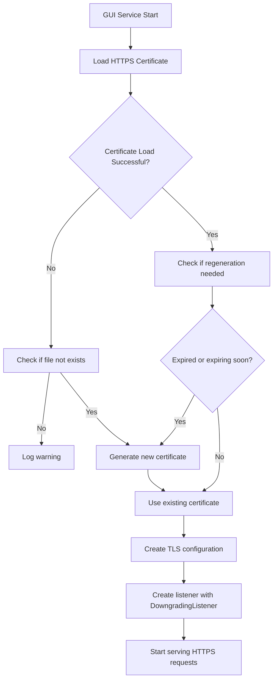

# SSL Handshake Error Analysis and Resolution Design

## 1. Overview

This document analyzes the SSL handshake error occurring in Syncthing's GUI/API interface, specifically the error: "A negociação de SSL falhou: Falha no handshake:Um token interno era inválido" (SSL negotiation failed: Handshake failure: An internal token was invalid). This error prevents access to the REST API endpoints at `https://127.0.0.1:8384/rest/system/connections` and `https://127.0.0.1:8384/rest/system/error`. Additionally, folders are not being found or scanned, which may be contributing to or related to the SSL handshake issues.

## 2. Problem Analysis

### 2.1 Error Details
- **Error Message**: "A negociação de SSL falhou: Falha no handshake:Um token interno era inválido"
- **Affected Endpoints**: 
  - `https://127.0.0.1:8384/rest/system/connections`
  - `https://127.0.0.1:8384/rest/system/error`
- **Context**: The error occurs when trying to access the Syncthing GUI/API over HTTPS

### 2.2 System Information from Logs
- Syncthing version: v2.0.6 "Beryllium Bedbug"
- Build information: go1.25.1 windows-amd64
- GUI/API listening on: 127.0.0.1:8384
- TLS configuration in use

### 2.3 Root Cause Analysis

Based on the code analysis, the SSL handshake error is likely caused by one of the following issues:

1. **Certificate Validation Failure**: The HTTPS certificate used by the GUI/API may be corrupted, expired, or incompatible
2. **TLS Configuration Issues**: Problems with the TLS configuration or cipher suites
3. **Certificate Regeneration Problems**: Issues with the automatic certificate regeneration process
4. **Platform-Specific Issues**: Windows-specific TLS handling problems
5. **DowngradingListener Issues**: Problems with the TLS detection mechanism that handles both TLS and non-TLS connections
6. **System Time Issues**: Incorrect system time causing certificate validation failures
7. **Folder Scanning Issues**: Problems with folder scanning that may be related to or causing SSL handshake failures
8. **Resource Exhaustion**: High resource consumption from folder scanning operations affecting SSL connection handling
9. **Folder Discovery Issues**: Folders not being found or properly indexed, potentially affecting the system's ability to serve API requests

## 3. Current SSL/TLS Implementation

### 3.1 Certificate Management
Syncthing uses self-signed certificates for GUI/API access:
- Certificates are automatically generated at first run
- Stored in: `locations.Get(locations.HTTPSCertFile)` and `locations.Get(locations.HTTPSKeyFile)`
- Uses ECDSA-P256 keys for browser compatibility
- Certificates are regenerated if expired or expiring within 30 days

### 3.2 TLS Configuration
- Uses `tlsutil.SecureDefaultWithTLS12()` configuration
- Supports TLS 1.2 as minimum version
- Uses secure cipher suites prioritized for performance

### 3.3 DowngradingListener Implementation
Syncthing uses a `DowngradingListener` to handle both TLS and non-TLS connections on the same port:
- Detects TLS connections by checking for the TLS handshake byte (0x16)
- Wraps TLS connections with `tls.Server()`
- Passes non-TLS connections through directly

### 3.4 Certificate Loading Process


### 3.5 Folder Scanning and Resource Usage

Syncthing uses a concurrency limiting mechanism for folder operations to prevent resource exhaustion:

1. **MaxFolderConcurrency**: Controls how many folders may concurrently be in I/O-intensive operations such as syncing or scanning
   - Default value: Number of logical CPU cores in the system
   - Can be configured to limit concurrent operations
   - When set to 0, defaults to the number of logical CPUs
   - When set to a negative value, removes all limits

2. **Resource Exhaustion Impact on SSL**: 
   - High CPU or memory usage from intensive folder scanning can affect SSL connection handling
   - I/O bottlenecks from scanning operations can delay SSL handshake processing
   - Semaphore-based limiting mechanism can cause delays in SSL connection establishment when resources are constrained

3. **Folder Discovery Issues**:
   - Folders may not be properly indexed or found in the filesystem
   - Filesystem permissions issues may prevent folder scanning
   - Path resolution problems may cause folders to appear missing
   - Configuration errors in folder definitions may prevent proper scanning
   - Issues with the folder state management system may cause scanning to fail

## 4. Solution Design

### 4.1 Immediate Fixes

#### 4.1.1 Certificate Validation and Regeneration
```
// Check certificate status
1. Verify certificate file exists and is readable
2. Parse certificate to check for corruption
3. Validate certificate expiry date
4. Check certificate compatibility with platform (especially macOS)
5. Validate system time is correct for certificate validation
6. Check if folder scanning issues might be affecting certificate handling
7. If any issues found, regenerate certificate
```

#### 4.1.2 Resource Usage Monitoring
```
// Monitor resource usage related to folder scanning
1. Check MaxFolderConcurrency configuration and current usage
2. Monitor for "Waiting to Scan" or "Waiting to Sync" folder states
3. Check for high CPU or memory usage during scanning operations
4. Monitor I/O bottlenecks that might affect SSL connection handling
5. Verify that semaphore-based limiting is not causing SSL connection delays
```

#### 4.1.3 Folder Discovery and Scanning Diagnostics
```
// Diagnose folder discovery and scanning issues
1. Verify folder paths exist and are accessible
2. Check filesystem permissions for folder paths
3. Validate folder configuration in the Syncthing config
4. Check for issues with the folder state management system
5. Monitor folder scanning progress and errors
6. Identify folders that are not being found or scanned properly
```

#### 4.1.4 Enhanced Error Handling
```
// Improve error reporting for TLS issues
1. Add detailed logging for certificate loading failures
2. Add specific error messages for different failure types
3. Log TLS handshake errors with more context
4. Add error logging for DowngradingListener failures
5. Include system time validation in error reporting
6. Add folder scanning error diagnostics that might be related to SSL issues
7. Add folder discovery failure diagnostics
```

### 4.2 Long-term Improvements

#### 4.2.1 Certificate Health Monitoring
- Implement periodic certificate health checks
- Add proactive certificate regeneration before expiry
- Monitor for platform compatibility issues

#### 4.2.2 Improved Error Reporting
- Add specific error codes for different SSL failure types
- Provide user-friendly error messages with resolution steps
- Add diagnostic information to help troubleshoot SSL issues
- Include certificate validation results in error reporting
- Add system time validation to error context
- Include folder scanning status in SSL error diagnostics
- Add resource usage information to SSL error context
- Include folder discovery diagnostics in error reporting

#### 4.2.3 Enhanced Folder Management
- Implement robust folder discovery mechanisms
- Add folder path validation and error reporting
- Improve folder scanning reliability and error handling
- Add folder scanning progress monitoring
- Implement folder scanning retry mechanisms for transient failures

## 5. Implementation Plan

### 5.1 Phase 1: Diagnostic Enhancement
1. Add detailed logging for certificate loading process
2. Enhance error messages with specific failure reasons
3. Add certificate validation checks
4. Add system time validation
5. Add DowngradingListener error diagnostics
6. Add folder scanning diagnostics that might be related to SSL issues
7. Add resource usage monitoring for folder operations
8. Add MaxFolderConcurrency status to diagnostics
9. Add folder discovery diagnostics
10. Implement folder path validation checks

### 5.2 Phase 2: Fix Implementation
1. Implement robust certificate regeneration logic
2. Add fallback mechanisms for certificate issues
3. Improve TLS configuration error handling
4. Fix DowngradingListener error handling
5. Add system time synchronization checks
6. Address folder scanning issues that may be contributing to SSL handshake failures
7. Implement resource usage optimization for folder scanning
8. Add configurable limits for folder concurrency to prevent resource exhaustion
9. Fix folder discovery issues preventing folders from being found
10. Implement folder scanning retry mechanisms

### 5.3 Phase 3: Monitoring and Prevention
1. Add periodic certificate health checks
2. Implement proactive certificate renewal
3. Add diagnostic tools for SSL/TLS issues
4. Implement folder scanning progress monitoring
5. Add folder discovery health checks
6. Implement automated folder scanning recovery mechanisms

## 6. Testing Strategy

### 6.1 Unit Tests
- Test certificate loading with various error conditions
- Test certificate regeneration logic
- Test TLS configuration creation
- Test DowngradingListener with various connection types
- Test system time validation
- Test folder scanning functionality and its relationship to SSL handling
- Test folder discovery mechanisms
- Test folder path validation

### 6.2 Integration Tests
- Test GUI/API access with valid certificates
- Test behavior with expired certificates
- Test certificate regeneration process
- Test DowngradingListener with mixed TLS/non-TLS connections
- Test behavior with incorrect system time
- Test folder scanning functionality and its impact on SSL connections
- Test resource exhaustion scenarios from intensive folder scanning
- Test MaxFolderConcurrency limits and their impact on SSL connections
- Test folder discovery with various path configurations
- Test folder scanning with permission issues

### 6.3 Manual Testing
- Verify fix resolves the reported SSL handshake error
- Test GUI access after certificate regeneration
- Test API endpoints functionality
- Test with simulated incorrect system time
- Test mixed TLS/non-TLS connection handling
- Test folder scanning functionality and verify it doesn't interfere with SSL connections
- Test resource usage during intensive folder scanning operations
- Test SSL connection handling under high folder concurrency scenarios
- Verify folders are properly discovered and scanned
- Test folder scanning with various permission scenarios
- Test folder discovery with different path configurations

## 7. Security Considerations

- Ensure new certificates are generated with secure parameters
- Maintain backward compatibility with existing certificate handling
- Ensure private keys are properly protected
- Validate certificate attributes to prevent security issues
- Ensure folder path validation prevents directory traversal attacks
- Validate folder configuration to prevent unauthorized access

## 8. Rollback Plan

If issues are found after deployment:
1. Revert to previous certificate handling logic
2. Manually regenerate certificates using command-line tools
3. Provide users with manual certificate regeneration instructions
4. Disable DowngradingListener and use standard TLS listener
5. Provide workaround for system time issues
6. Temporarily disable folder scanning features to isolate SSL issues
7. Provide manual folder configuration validation steps