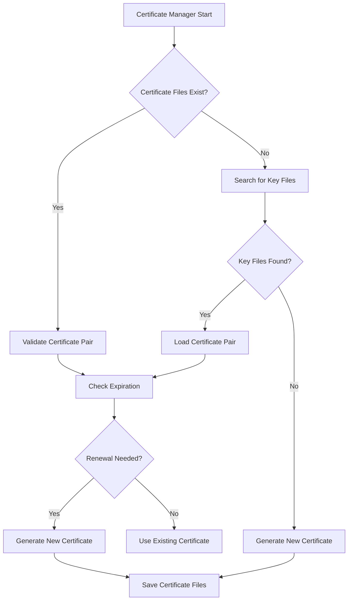
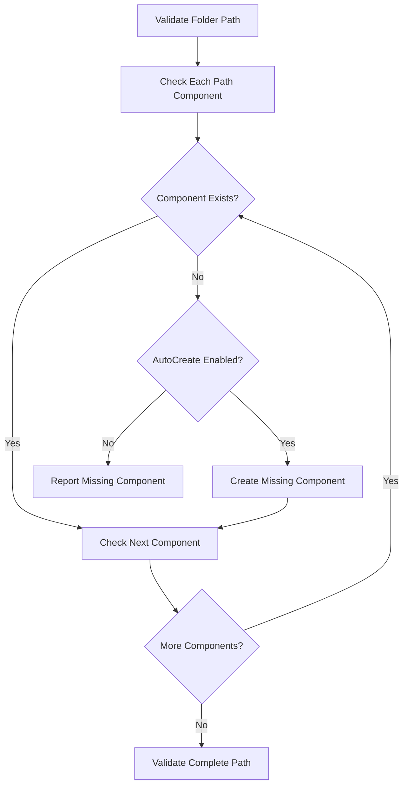

# Syncthing Configuration Fix Design Document

## 1. Overview

This document outlines the design for fixing configuration issues identified in Syncthing logs:
1. Certificate file resolution failures
2. Folder path existence issues where "D:Syncthing" path components are missing
3. Mixed case folder path warnings
4. High memory usage warnings for folders

## 2. Architecture

### 2.1 Current System Components

- **Configuration Service**: Loads, validates, and manages configuration files
- **Folder Configuration**: Manages folder-specific settings and path validation
- **Certificate Manager**: Handles TLS certificate generation and validation
- **Folder Health Monitor**: Periodically checks folder health and issues warnings

### 2.2 Proposed Enhancements

```
┌─────────────────────────────────────────────────────────────────────┐
│                        Syncthing Application                        │
├─────────────────────────────────────────────────────────────────────┤
│  Configuration     Folder Health    Certificate      API & GUI      │
│      Service        Monitor         Manager          Service       │
│         │              │              │              │             │
│         └──────────────┼──────────────┼──────────────┘             │
│                        │              │                            │
│                Enhanced Validation  Improved                     │
│                   & Auto-Creation   Certificate                   │
│                        │          Management                     │
│                        │              │                          │
│                 ┌──────▼──────────────▼──────┐                   │
│                 │   Configuration Fix Module  │                   │
│                 │   - Path Validation         │                   │
│                 │   - Auto-Create Missing     │                   │
│                 │   - Certificate Handling    │                   │
│                 │   - Memory Usage Monitoring │                   │
│                 └─────────────────────────────┘                   │
└─────────────────────────────────────────────────────────────────────┘
```

## 3. Configuration Issues Analysis

### 3.1 Certificate File Resolution Failures

**Issue**: Certificate files not found with multiple key file attempts
```
WRN Failed to resolve certificate files (file=D:\SyncthingtrayPortable\Data\Configuration\cert.pem 
error="key file not found for certificate D:\\SyncthingtrayPortable\\Data\\Configuration\\cert.pem, 
tried: [D:\\SyncthingtrayPortable\\Data\\Configuration\\cert-key.pem 
D:\\SyncthingtrayPortable\\Data\\Configuration\\cert.key 
D:\\SyncthingtrayPortable\\Data\\Configuration\\cert_key.pem 
D:\\SyncthingtrayPortable\\Data\\Configuration\\cert-key.key 
D:\\SyncthingtrayPortable\\Data\\Configuration\\cert.priv
D:\\SyncthingtrayPortable\\Data\\Configuration\\cert.private
D:\\SyncthingtrayPortable\\Data\\Configuration\\cert_private.pem]")
```

**Root Cause**: The certificate manager searches for key files with specific naming patterns but fails to find them, then attempts to regenerate certificates.

**Solution**: Improve certificate file resolution by:
1. Expanding the search patterns for key files
2. Providing better error messages with actionable steps
3. Implementing automatic certificate regeneration with user notification

### 3.2 Folder Path Existence Issues

**Issue**: Multiple folders reporting missing path components:
```
WRN Folder path existence issue folder "Joplin" (11fwz-jlxp2) issue Path component 'D:Syncthing' (component 1 of path) does not exist. Parent directory 'D:' exists but this subdirectory is missing.
```

**Root Cause**: The parent directory "D:Syncthing" does not exist for multiple folders.

**Solution**: 
1. Implement automatic creation of missing parent directories when the `AutoCreateParentDirs` option is enabled
2. Improve error messages to be more actionable
3. Add GUI option to enable auto-creation for all folders at once

### 3.3 Mixed Case Folder Path Warnings

**Issue**: Warnings about mixed case folder paths:
```
WRN Folder path validation issue folder "Joplin" (11fwz-jlxp2) issue Folder path contains mixed case, which may cause issues on case-sensitive filesystems action Use consistent case in folder path
```

**Root Cause**: Folder paths contain mixed case characters which can cause issues on case-sensitive filesystems.

**Solution**:
1. Add option to automatically convert folder paths to consistent case (lowercase)
2. Provide clear guidance in the warning message about the implications
3. Add GUI validation to warn users when creating folders with mixed case

### 3.4 High Memory Usage Warnings

**Issue**: Folders using excessive memory:
```
WRN Folder using very high memory, reducing check frequency (folder=27xo7-9ega6 memoryBytes=6592897024 newInterval=1m0s log.pkg=model)
```

**Root Cause**: Folders with large numbers of files consume excessive memory during health checks.

**Solution**:
1. Implement smarter health check algorithms that consume less memory
2. Add configuration options to limit memory usage per folder
3. Provide recommendations to users on optimizing folder structure

## 4. Detailed Design

### 4.1 Certificate Management Improvements

#### 4.1.1 Enhanced Certificate Resolution

The certificate manager will be enhanced to:
1. Expand key file search patterns to include more common naming conventions
2. Implement a more robust certificate file validation process
3. Provide detailed error messages with actionable steps



#### 4.1.2 Certificate Regeneration Process

When certificate files are missing or invalid:
1. Attempt to locate key files using expanded search patterns
2. If not found, generate new certificate/key pair
3. Save to standard locations
4. Notify user through GUI and logs

### 4.2 Folder Path Validation and Auto-Creation

#### 4.2.1 Enhanced Path Validation

The folder configuration validation will be improved to:
1. Check each path component individually to identify exactly where the issue is
2. Provide detailed error messages with actionable steps
3. Implement automatic creation of missing directories when enabled



#### 4.2.2 Auto-Creation Implementation

When `AutoCreateParentDirs` is enabled:
1. Check each path component from root to leaf
2. Create missing parent directories
3. Create the final folder directory if it doesn't exist
4. Validate permissions on created directories

### 4.3 Mixed Case Path Handling

#### 4.3.1 Path Case Validation

The folder path validation will:
1. Detect mixed case paths
2. Warn users about potential issues on case-sensitive filesystems
3. Provide option to automatically convert to lowercase

#### 4.3.2 Case Conversion Feature

A new configuration option will be added:
- `AutoConvertToLowerCase`: Automatically convert folder paths to lowercase

### 4.4 Memory Usage Optimization

#### 4.4.1 Health Check Optimization

The folder health monitor will:
1. Implement memory-aware health check intervals
2. Use streaming algorithms for large directory checks
3. Provide recommendations for optimizing folder structure

#### 4.4.2 Memory Throttling

New configuration options:
- `MaxMemoryUsageMB`: Maximum memory usage per folder (default: 1024MB)
- `ThrottlingEnabled`: Enable memory usage throttling (default: true)

## 5. API Endpoints

### 5.1 Certificate Management Endpoints

| Endpoint | Method | Description |
|----------|--------|-------------|
| `/rest/cert/status` | GET | Get certificate status and expiration information |
| `/rest/cert/regenerate` | POST | Force regeneration of certificates |
| `/rest/cert/config` | GET/POST | Get/set certificate configuration options |

### 5.2 Folder Management Endpoints

| Endpoint | Method | Description |
|----------|--------|-------------|
| `/rest/folder/health` | GET | Get folder health status |
| `/rest/folder/resolve` | POST | Attempt to resolve folder issues |
| `/rest/folder/auto-create` | POST | Enable auto-creation for all folders |

## 6. GUI Changes

### 6.1 Certificate Management UI

Add a new section in the GUI for certificate management:
- Certificate status display (valid/invalid, expiration date)
- Regeneration button
- Configuration options for certificate handling

### 6.2 Folder Health Dashboard

Enhance the folder health display:
- Detailed error messages with actionable steps
- One-click resolution for common issues
- Auto-creation toggle for each folder

### 6.3 Configuration Wizard

Add a setup wizard that:
- Checks for common configuration issues
- Provides guided resolution
- Enables best practice configurations

## 7. Configuration Options

### 7.1 New Global Options

```xml
<options>
  <autoConvertToLowerCase>false</autoConvertToLowerCase>
  <maxMemoryUsageMB>1024</maxMemoryUsageMB>
  <throttlingEnabled>true</throttlingEnabled>
</options>
```

### 7.2 New Folder Options

```xml
<folder>
  <autoCreateParentDirs>false</autoCreateParentDirs>
  <maxMemoryUsageMB>1024</maxMemoryUsageMB>
  <throttlingEnabled>true</throttlingEnabled>
</folder>
```

## 8. Implementation Plan

### 8.1 Phase 1: Certificate Management (Week 1-2)

1. Enhance certificate resolution logic
2. Implement expanded key file search patterns
3. Add certificate status API endpoints
4. Create GUI certificate management interface

### 8.2 Phase 2: Folder Path Validation (Week 3-4)

1. Implement enhanced path component validation
2. Add auto-creation functionality
3. Create folder health resolution API
4. Enhance GUI folder health display

### 8.3 Phase 3: Memory Optimization (Week 5-6)

1. Implement memory-aware health checks
2. Add memory throttling configuration
3. Create optimization recommendations system
4. Update GUI with memory usage information

### 8.4 Phase 4: Testing and Refinement (Week 7-8)

1. Comprehensive testing of all new features
2. Performance testing with large folder structures
3. User experience testing and refinement
4. Documentation updates

## 9. Testing Strategy

### 9.1 Unit Tests

- Certificate resolution with various file naming patterns
- Path component validation with missing directories
- Memory usage monitoring and throttling
- Mixed case path detection and conversion

### 9.2 Integration Tests

- End-to-end certificate management workflows
- Folder auto-creation scenarios
- Health check optimization with large directories
- GUI interaction tests

### 9.3 Performance Tests

- Memory usage with folders containing 100k+ files
- Health check performance with throttling enabled
- Certificate regeneration performance

## 10. Backward Compatibility

All changes will maintain backward compatibility:
- Existing configurations will continue to work
- New options will have sensible defaults
- Deprecated options will be handled gracefully
- Migration paths will be provided for any breaking changes

## 11. Security Considerations

- Certificate files will be created with appropriate permissions (0600)
- Auto-created directories will have secure default permissions
- All new API endpoints will follow existing authentication patterns
- No new security vulnerabilities will be introduced