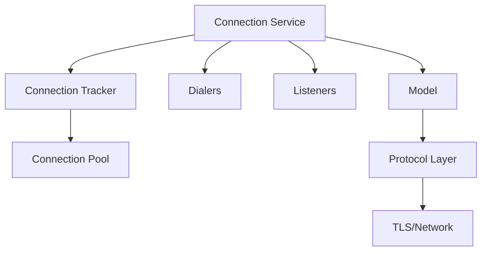
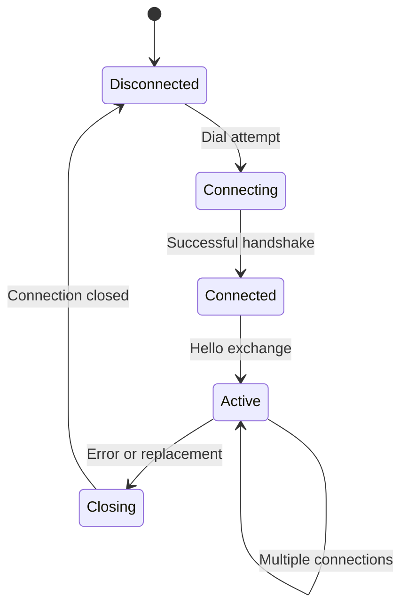

# Syncthing Connection Issues Analysis and Resolution Design

## 1. Overview

This document analyzes recurring connection issues in Syncthing as evidenced by the provided logs. Multiple devices are experiencing frequent connection drops with the error "replacing connection", indicating instability in the peer-to-peer communication layer.

## 2. Problem Statement

From the logs, we can observe:
1. Device connections are being repeatedly established and lost within seconds
2. Both direct LAN connections (TCP/QUIC) and relay connections are affected
3. The error message "replacing connection" suggests connection conflicts or instability
4. Multiple connection types are attempted (TCP client/server, QUIC server, relay client) but all fail

## 3. Repository Type

This is a Backend Application repository implementing a peer-to-peer file synchronization service.

## 4. Architecture

### 4.1 Connection Management System

Syncthing implements a sophisticated connection management system with the following key components:



### 4.2 Connection Lifecycle



## 5. API Endpoints Reference

Syncthing's connection management does not expose traditional REST APIs but uses internal interfaces:

- `Service` interface for connection handling
- `Model` interface for device connection management
- Protocol layer for message exchange

## 6. Data Models & ORM Mapping

### 6.1 Connection Structures

- `internalConn`: Raw TLS connection with metadata
- `ConnectionStatusEntry`: Connection status tracking
- `ListenerStatusEntry`: Listener status information

### 6.2 Connection Tracking

- `deviceConnectionTracker`: Tracks connections per device
- Connection pools for managing multiple connections
- Priority-based connection selection

## 7. Business Logic Layer

### 7.1 Connection Establishment Flow

1. **Dialing Process**
   - Resolve device addresses (static or dynamic)
   - Attempt connections through multiple dialers
   - Validate device identity and certificates
   - Exchange Hello messages

2. **Connection Validation**
   - Certificate verification
   - Device ID matching
   - Protocol negotiation
   - Hello message exchange

3. **Connection Promotion**
   - Primary connection selection
   - ClusterConfig exchange
   - Index handler initialization

### 7.2 Connection Management Logic

#### 7.2.1 Multiple Connection Handling

Syncthing supports multiple connections per device with priority-based selection:

```go
// Connection priorities (lower is better)
const (
    priorityCritical = iota // Introducer connections
    priorityHigh           // Recently seen devices
    priorityNormal         // Regular devices
    priorityLow            // Relays and other fallbacks
)
```

#### 7.2.2 Connection Replacement Logic

The "replacing connection" error occurs when the system closes existing connections to make room for better ones:

```go
// closeWorsePriorityConnectionsLocked closes connections with worse priority
func (c *deviceConnectionTracker) closeWorsePriorityConnectionsLocked(d protocol.DeviceID, cutoff int) {
    var connsToClose []protocol.Connection
    for _, conn := range c.connections[d] {
        if p := conn.Priority(); p > cutoff {
            connsToClose = append(connsToClose, conn)
        }
    }
    
    if len(connsToClose) > 0 {
        go func() {
            for _, conn := range connsToClose {
                conn.Close(errReplacingConnection)
            }
        }()
    }
}
```

#### 7.2.3 Connection Upgrade Mechanism

Syncthing implements connection upgrades based on priority thresholds:

1. New connections are evaluated against existing ones
2. If a new connection has better priority (lower number) than the worst existing connection plus upgrade threshold, it's accepted
3. Existing worse connections are closed with "replacing connection" error

### 7.3 Error Handling

#### 7.3.1 Common Connection Errors

- `errReplacingConnection`: Connection replaced by better one
- `errDeviceAlreadyConnected`: Device already has desired connections
- `errNetworkNotAllowed`: Connection from disallowed network
- `errDevicePaused`: Device is paused

#### 7.3.2 Error Propagation

Connection errors are logged and propagated through the system:

1. Connection closure triggers `Closed()` callback
2. Model updates connection state
3. Event system broadcasts disconnection events
4. Connection service schedules reconnection

## 8. Middleware & Interceptors

### 8.1 Connection Limiters

Rate limiting for connections:

- Global connection limits
- Per-device connection limits
- Bandwidth limiting
- Parallel dial limits

### 8.2 Connection Validation

- Certificate validation
- Device ID verification
- Network allowance checking
- Protocol compatibility verification

## 9. Root Cause Analysis

Based on the provided logs, the "replacing connection" errors occur due to:

### 9.1 Connection Churn

Devices are establishing multiple connections in quick succession:

```
2025-09-11 09:06:44 INF Established secure connection (device=HYGSE4S...)
2025-09-11 09:06:45 INF Lost device connection (... error="replacing connection")
2025-09-11 09:07:07 INF Established secure connection (device=HYGSE4S...)
2025-09-11 09:07:08 INF Lost device connection (... error="replacing connection")
```

### 9.2 Priority Conflicts

Multiple connection attempts with different priorities are causing replacements:

- LAN connections (priority 10)
- QUIC connections (priority 20)
- Relay connections (priority 50)

When a better priority connection is established, worse ones are closed.

### 9.3 Multipath Connection Issues

The system attempts multiple connection types simultaneously:

1. TCP client
2. TCP server
3. QUIC server
4. Relay client

This can lead to connection conflicts when multiple succeed and then replace each other.

## 10. Proposed Solutions

### 10.1 Connection Stability Improvements

#### 10.1.1 Enhanced Connection Validation

Implement more robust connection validation to prevent unnecessary replacements:

1. Add connection quality metrics before accepting new connections
2. Implement hysteresis to prevent rapid connection switching
3. Use adaptive thresholds based on network conditions

#### 10.1.2 Improved Multipath Management

Better coordination of multiple connection types:

1. Implement connection convergence algorithms
2. Add preference for stable connections over new ones
3. Use connection health scoring

### 10.2 Configuration Recommendations

#### 10.2.1 Connection Priority Tuning

Adjust connection priority upgrade thresholds:

```xml
<options>
  <connectionPriorityUpgradeThreshold>10</connectionPriorityUpgradeThreshold>
</options>
```

#### 10.2.2 Connection Limits

Configure appropriate connection limits:

```xml
<options>
  <maxConcurrentIncomingRequests>4</maxConcurrentIncomingRequests>
  <connectionLimitMax>100</connectionLimitMax>
</options>
```

### 10.3 Monitoring and Diagnostics

#### 10.3.1 Enhanced Logging

Add more detailed connection diagnostics:

1. Connection quality metrics
2. Replacement reason tracking
3. Network condition monitoring

#### 10.3.2 Health Monitoring

Implement connection health monitoring:

1. Latency tracking
2. Packet loss detection
3. Bandwidth measurement

## 11. Testing

### 11.1 Unit Tests

Key components to test:

1. Connection priority logic
2. Connection replacement mechanisms
3. Multipath connection handling
4. Error propagation

### 11.2 Integration Tests

1. Connection churn scenarios
2. Priority-based replacement testing
3. Multipath coordination testing
4. Network failure recovery

### 11.3 Performance Tests

1. Connection establishment rate
2. Memory usage with many connections
3. CPU usage during connection churn
4. Bandwidth utilization efficiency
