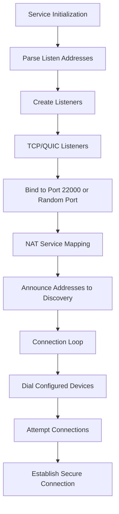
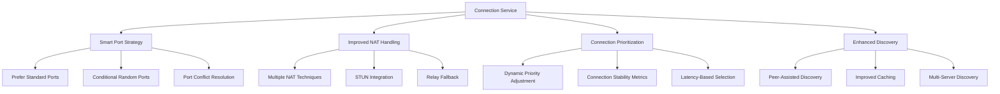
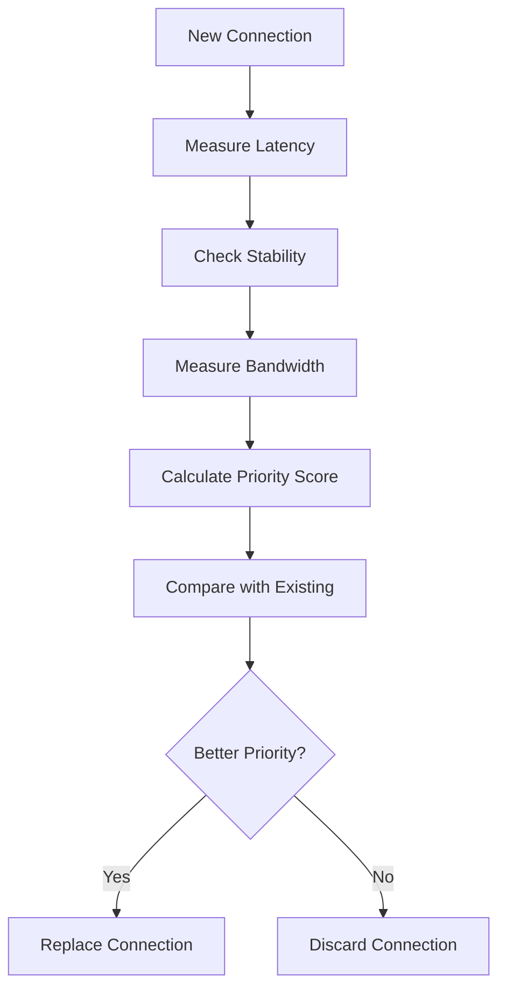

# Syncthing Connection Optimization Design Document

## 1. Overview

This document outlines the design for optimizing Syncthing's connection establishment and management to improve connectivity between devices. Based on user feedback, the current implementation of random port allocation appears to provide limited benefits since most Syncthing instances use the default port 22000. This design proposes targeted improvements to connection establishment, NAT traversal, and port management to enhance connection reliability and performance while addressing the specific concerns about random port effectiveness. The improvements will be automatic with no new configuration options required.

## 2. Current Architecture

### 2.1 Connection Establishment Flow

### 2.2 Key Components

1. **Connection Service**: Manages all connections, listeners, and dialing logic
2. **Listeners**: TCP and QUIC listeners that accept incoming connections
3. **NAT Service**: Handles port mapping with UPnP and NAT-PMP
4. **Discovery Service**: Global and local discovery mechanisms
5. **Random Port Allocator**: Allocates random ports within configured ranges

### 2.3 Current Issues

1. **Random Port Ineffectiveness**: As noted in user feedback, random ports provide limited benefit since most Syncthing instances use the standard port 22000, making it more predictable and compatible to use standard ports
2. **NAT Traversal Challenges**: Port mapping failures can prevent connections, especially when using non-standard ports
3. **Connection Prioritization**: Current priority system may not optimally select connections
4. **Discovery Limitations**: Global discovery may not always find devices behind restrictive NATs

## 3. Proposed Improvements

### 3.1 Enhanced Connection Strategy

### 3.2 Smart Port Management

The current random port implementation will be replaced with a smarter approach that addresses the ineffectiveness of random ports:

1. **Prefer Standard Ports**: Automatically use port 22000 by default since it's the standard and most compatible option
2. **Conditional Random Ports**: Only use random ports when there's an automatic port conflict detection
3. **Port Conflict Detection**: Automatically detect port conflicts and only then consider alternatives
4. **Improved Port Announcement**: Better announcement of listening ports to discovery services

All these improvements will work automatically without requiring user configuration.

### 3.3 Enhanced NAT Handling

Improvements to NAT traversal:

1. **STUN Integration**: Better integration with STUN servers for NAT type detection
2. **Multiple Mapping Attempts**: Try multiple port mapping strategies
3. **Relay Fallback**: Improved relay connection fallback mechanisms

### 3.4 Connection Prioritization

Enhanced connection selection based on:

1. **Latency Measurements**: Continuous latency monitoring for connection quality
2. **Stability Metrics**: Track connection stability over time
3. **Bandwidth Testing**: Measure available bandwidth on connections

## 4. Implementation Details

### 4.1 Configuration Changes

No new configuration options will be added. The improvements will work automatically with the existing configuration. The system will:

1. Automatically prefer standard ports (22000) for maximum compatibility
2. Only use random ports when conflicts are detected
3. Make all decisions automatically without user intervention

### 4.2 Service Modifications

#### 4.2.1 Connection Service

The connection service will be enhanced with automatic improvements:

1. **Automatic Listener Management**:
   - Automatically prefer standard ports (22000) for maximum compatibility
   - Only use random ports when conflicts are automatically detected
   - Implement robust automatic port conflict detection and resolution

2. **Enhanced Dialing Logic**:
   - Automatically prioritize connections to devices listening on standard ports
   - Implement connection health checks
   - Use multiple discovery sources concurrently

#### 4.2.2 NAT Service

The NAT service will be improved with automatic enhancements:

1. **Standard Port Focused Mapping**:
   - Automatically prioritize mapping standard ports (22000) for better compatibility
   - Only attempt random port mapping when standard ports fail
   - Better error handling and recovery

2. **Mapping Validation**:
   - Automatically validate port mappings work correctly
   - Implement mapping validation mechanisms

### 4.3 Discovery Enhancements

#### 4.3.1 Global Discovery

Improvements to global discovery:

1. **Multi-Server Support**: Query multiple discovery servers concurrently
2. **Caching Improvements**: Enhanced caching with better expiration handling
3. **Peer-Assisted Discovery**: Leverage connected peers to discover other devices

#### 4.3.2 Local Discovery

Local discovery enhancements:

1. **Improved Multicast**: Better handling of multicast packets
2. **IPv6 Support**: Enhanced IPv6 local discovery
3. **Network Interface Awareness**: Better handling of multiple network interfaces

## 5. Connection Management Strategy

### 5.1 Connection Prioritization Algorithm

Priority calculation factors:
- **Latency**: Lower latency connections get higher priority
- **Stability**: Stable connections are preferred over unstable ones
- **Bandwidth**: Higher bandwidth connections are prioritized
- **Protocol**: QUIC may be prioritized over TCP based on configuration
- **Network Type**: LAN connections may be prioritized over WAN

### 5.2 Connection Health Monitoring

Continuous monitoring of connection health:

1. **Latency Tracking**: Measure round-trip time continuously
2. **Packet Loss Detection**: Monitor for packet loss patterns
3. **Bandwidth Measurement**: Periodic bandwidth testing
4. **Stability Metrics**: Track connection uptime and reliability

## 6. Security Considerations

1. **Certificate Validation**: Continue strict certificate validation for all connections
2. **Port Security**: Ensure random ports don't expose unnecessary services
3. **Discovery Security**: Validate discovery information before use
4. **NAT Traversal Security**: Secure STUN and relay connections

## 7. Backward Compatibility

The improvements will maintain backward compatibility:

1. **Default Behavior**: Default settings will maintain current behavior
2. **Configuration Migration**: Existing configurations will continue to work
3. **Protocol Compatibility**: All changes will be compatible with existing Syncthing protocol

## 8. Testing Strategy

### 8.1 Unit Tests

1. **Port Allocation Tests**: Verify automatic port allocation logic
2. **NAT Handling Tests**: Test various NAT scenarios and mapping strategies
3. **Connection Prioritization Tests**: Validate priority calculation algorithms
4. **Discovery Tests**: Test discovery mechanisms with various network setups

### 8.2 Integration Tests

1. **Multi-Device Scenarios**: Test with multiple devices in various network configurations
2. **NAT Traversal Tests**: Test various NAT types and traversal scenarios
3. **Performance Tests**: Measure connection establishment time and reliability improvements

All tests will verify that the improvements work automatically without requiring configuration changes.

## 7. Monitoring and Metrics

New metrics to track optimization effectiveness:

1. **Connection Success Rate**: Percentage of successful connections
2. **Connection Establishment Time**: Time to establish connections
3. **Port Mapping Success Rate**: Success rate of NAT port mappings
4. **Discovery Success Rate**: Success rate of device discovery
5. **Standard Port Usage**: Percentage of connections using standard port 22000
6. **Random Port Necessity**: Frequency of actual need for random ports
7. **Connection Stability**: Measure of connection uptime and reliability

## 8. Conclusion

This design addresses the specific issue of random port ineffectiveness by focusing on standard port usage while maintaining the flexibility to use random ports when necessary. All improvements will work automatically without requiring any new configuration options. The key improvements include:

1. **Automatic Preference for Standard Ports**: Default to port 22000 for maximum compatibility
2. **Automatic Random Port Usage**: Only use random ports when conflicts are automatically detected
3. **Enhanced Connection Management**: Better prioritization and stability metrics
4. **Improved NAT Handling**: More effective port mapping strategies

These changes should result in more reliable connections between Syncthing devices while addressing the user concern that random ports provide limited benefit when most instances use the standard port. All improvements work automatically without user intervention.