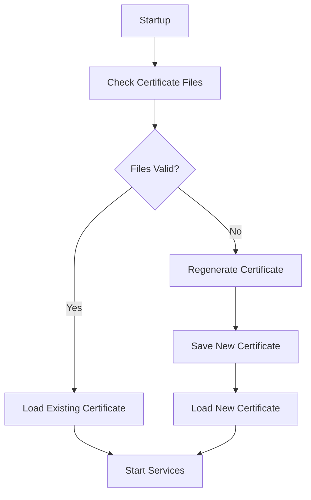
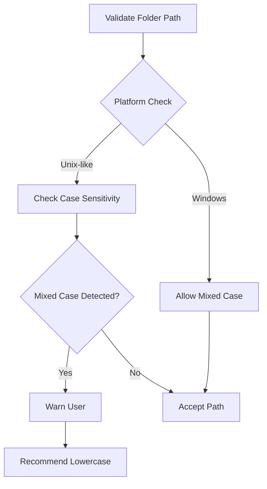
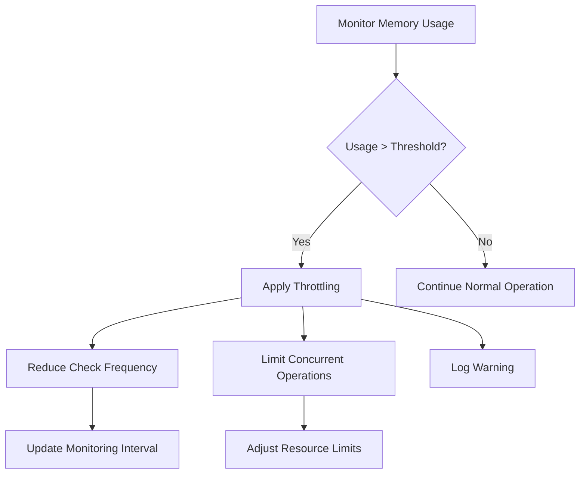
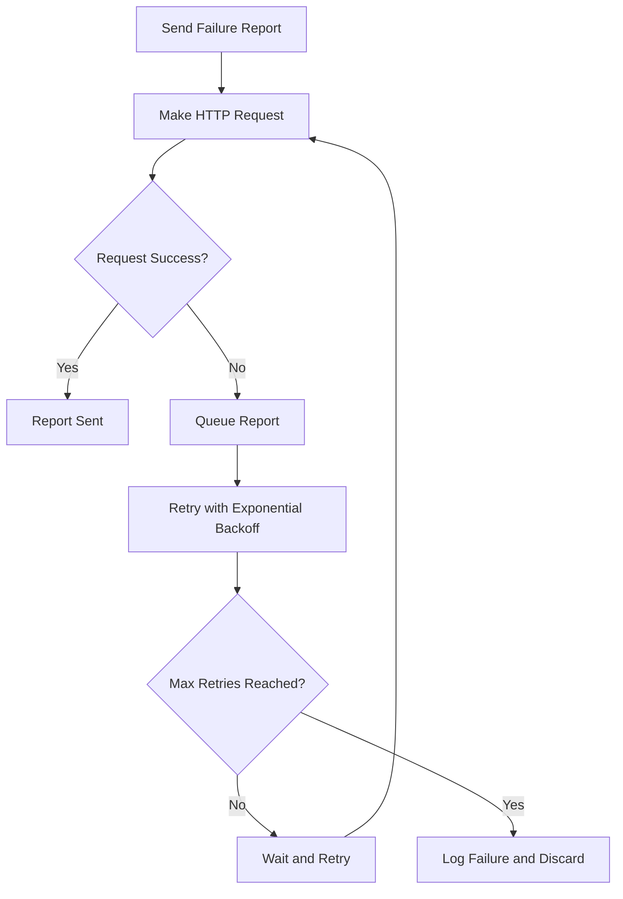
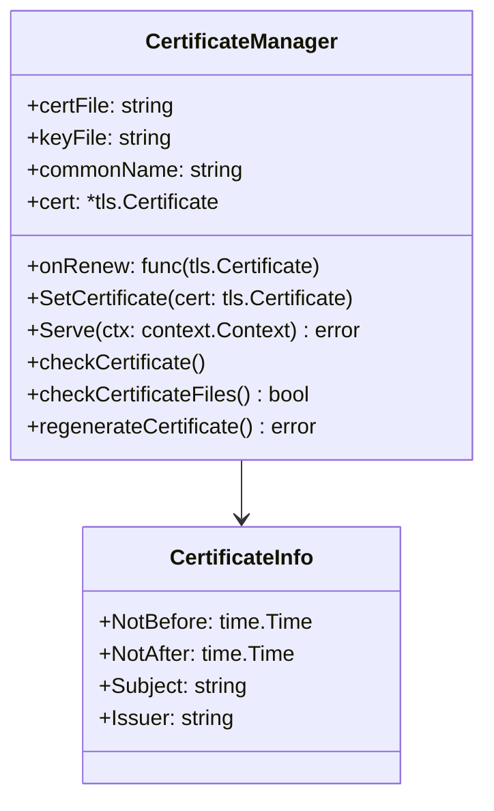
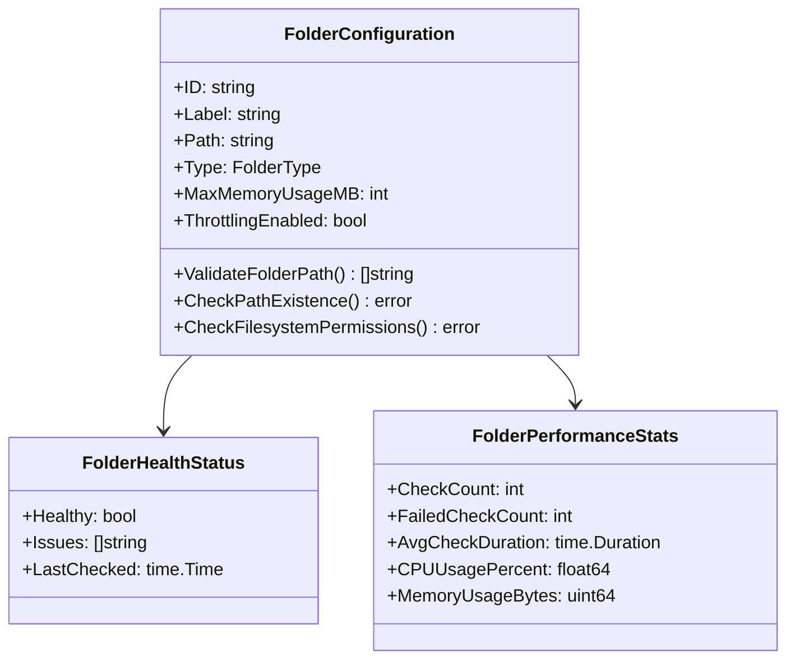
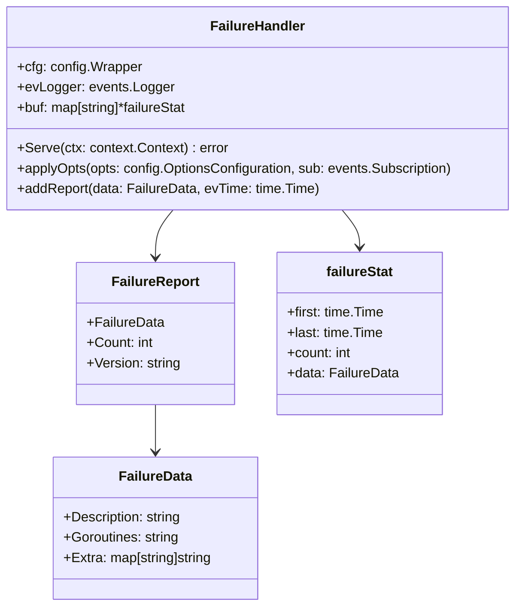

# Syncthing System Issues Analysis and Improvement Plan

## Overview

This document analyzes the issues observed in the Syncthing logs and proposes solutions to address certificate management, folder path validation, memory usage monitoring, and failure reporting problems.

## Architecture

Syncthing follows a peer-to-peer (P2P) distributed architecture with a modular monolith design in Go. The main components include:

1. **Core Components**:
   - Application Orchestrator (`cmd/syncthing/main.go`)
   - Synchronization Model (`lib/model/`)
   - Block Exchange Protocol (`lib/protocol/`)
   - REST API and GUI (`lib/api/`)
   - Network Connections (`lib/connections/`)

2. **Data Storage and Database**:
   - SQLite backend for metadata storage (`internal/db/`)
   - File system abstraction (`lib/fs/`)

3. **Networking Architecture**:
   - Connection Management (`lib/connections/`)
   - Discovery Mechanisms (`lib/discover/`)
   - Relay Communication (`lib/relay/`)
   - Transport Protocols (QUIC, TCP)

## Issues Analysis

Based on the log analysis, the following issues were identified:

### 1. Certificate Management Issues

**Problem**: 
```
WRN Failed to resolve certificate files (file=D:\SyncthingtrayPortable\Data\Configuration\cert.pem error="key file not found for certificate...)
INF Attempting to regenerate certificate (file=D:\SyncthingtrayPortable\Data\Configuration\cert.pem log.pkg=certmanager)
INF Successfully regenerated certificate (certFile=D:\SyncthingtrayPortable\Data\Configuration\cert.pem notAfter=2027-12-05T00:00:00Z log.pkg=certmanager)
```

**Root Cause**: 
The certificate manager attempts to find existing certificate files but fails, leading to automatic regeneration. This happens when:
- Certificate files are missing or corrupted
- Key files don't match certificate files
- File permissions prevent access to certificate files

**Affected Components**:
- `lib/certmanager/certmanager.go`
- `cmd/syncthing/main.go` (certificate loading)

### 2. Folder Path Validation Issues

**Problem**:
```
WRN Folder path validation issue folder "Sandbox" (z2any-tnw7h) issue Folder path contains mixed case, which may cause issues on case-sensitive filesystems
```

**Root Cause**: 
Folder paths contain mixed case characters, which can cause issues on case-sensitive filesystems (Linux, macOS). This is a cross-platform compatibility issue.

**Affected Components**:
- `lib/config/folderconfiguration.go` (ValidateFolderPath method)

### 3. High Memory Usage Issues

**Problem**:
```
WRN Folder using very high memory, reducing check frequency (folder=z2any-tnw7h memoryBytes=8904069120 newInterval=2m0s log.pkg=model)
WRN High memory usage detected for folder, throttling may be needed (folder=2cuhx-wiqrs memoryBytes=8904126464 maxAllowedMB=1024 log.pkg=model)
```

**Root Cause**: 
Folders are consuming excessive memory (8+ GB), triggering automatic throttling. The system reduces health check frequency to mitigate resource consumption.

**Affected Components**:
- `lib/model/folder_health_monitor.go` (memory monitoring and throttling)
- `lib/config/folderconfiguration.go` (MaxMemoryUsageMB setting)

### 4. Failure Reporting Network Issues

**Problem**:
```
WRN Failed to send failure report (error="Post \"https://crash.syncthing.net/newcrash/failure\": net/http: HTTP/1.x transport connection broken: malformed HTTP response...")
```

**Root Cause**: 
Failure reports cannot be sent to the crash reporting server due to network protocol issues. The server might be returning malformed responses or using incompatible protocols.

**Affected Components**:
- `lib/ur/failurereporting.go` (sendFailureReports function)

## System Components Analysis

### Certificate Manager Component

The certificate manager (`lib/certmanager/`) is responsible for:
1. Loading existing certificates
2. Generating new certificates when needed
3. Monitoring certificate expiration
4. Renewing certificates automatically

Key functions:
- `checkCertificateFiles()`: Verifies certificate file existence and validity
- `regenerateCertificate()`: Creates new certificate/key pairs
- `checkCertificate()`: Monitors expiration and triggers renewal

### Folder Configuration Component

The folder configuration (`lib/config/`) handles:
1. Folder path validation
2. Cross-platform compatibility checks
3. Resource usage limits
4. Permission validation

Key functions:
- `ValidateFolderPath()`: Checks for potential issues with folder paths
- `CheckPathExistenceDetailed()`: Verifies folder accessibility
- `ValidateFolderPaths()`: Performs comprehensive validation

### Folder Health Monitor Component

The folder health monitor (`lib/model/folder_health_monitor.go`) tracks:
1. CPU and memory usage
2. Health status changes
3. Performance statistics
4. Automatic throttling

Key functions:
- `checkResourceUsage()`: Monitors CPU/memory usage
- `getHealthCheckInterval()`: Adjusts monitoring frequency based on resource usage
- `ShouldThrottleFolder()`: Determines if folders should be throttled

### Failure Reporting Component

The failure reporting system (`lib/ur/failurereporting.go`) handles:
1. Collecting failure events
2. Aggregating similar failures
3. Sending reports to crash server

Key functions:
- `sendFailureReports()`: Sends JSON-encoded failure reports via HTTP POST
- `FailureHandler.Serve()`: Main service loop for processing events

## Proposed Solutions

### 1. Certificate Management Improvements

**Issue**: Certificate regeneration causes service interruption and log noise.

**Solution**:


**Implementation Plan**:
1. Improve certificate file validation to reduce false positives
2. Add more detailed logging for certificate validation failures
3. Implement backup certificate rotation to minimize regeneration

### 2. Folder Path Validation Enhancements

**Issue**: Mixed case folder paths cause warnings on case-sensitive systems.

**Solution**:


**Implementation Plan**:
1. Add platform-specific validation rules
2. Provide clearer user guidance on folder naming
3. Implement automatic path normalization option

### 3. Memory Usage Optimization

**Issue**: Folders consuming 8+ GB of memory trigger aggressive throttling.

**Solution**:


**Implementation Plan**:
1. Implement more granular memory monitoring
2. Add configurable memory limits per folder
3. Optimize folder scanning algorithms to reduce memory footprint
4. Implement memory pressure detection and automatic cleanup

### 4. Failure Reporting Reliability

**Issue**: Network errors prevent failure reports from being sent.

**Solution**:


**Implementation Plan**:
1. Add retry mechanism with exponential backoff
2. Implement local queuing for failed reports
3. Add support for alternative reporting endpoints
4. Improve error handling and logging

## Data Models

### Certificate Management Data Model



### Folder Configuration Data Model



### Failure Reporting Data Model



## Business Logic

### Certificate Lifecycle Management

1. **Initialization**:
   - Load existing certificates
   - Validate certificate/key pair integrity
   - Check expiration dates

2. **Monitoring**:
   - Periodic health checks (every 6 hours)
   - Expiration threshold monitoring (30 days)
   - Automatic renewal when needed

3. **Regeneration**:
   - Triggered when certificates are missing or invalid
   - Creates new certificate/key pairs with 10-year validity
   - Updates all services using the certificate

### Folder Health Monitoring

1. **Resource Monitoring**:
   - CPU usage tracking
   - Memory consumption monitoring
   - Performance metrics collection

2. **Throttling Logic**:
   - Memory threshold: 1GB (warning), configurable maximum
   - CPU threshold: 80% (warning), configurable maximum
   - Adaptive check intervals based on resource usage

3. **Alerting**:
   - Log warnings for resource issues
   - Emit events for external monitoring
   - Adjust behavior to reduce resource consumption

### Failure Reporting Process

1. **Event Collection**:
   - Subscribe to failure events
   - Aggregate similar failures
   - Buffer reports for batch sending

2. **Report Generation**:
   - Encode failure data as JSON
   - Include system information
   - Add stack traces when available

3. **Transmission**:
   - Send via HTTP POST to crash reporting server
   - Handle network errors gracefully
   - Implement retry logic for failed transmissions

## Testing Strategy

### Certificate Management Tests

1. **Unit Tests**:
   - Certificate file validation logic
   - Certificate generation and renewal
   - Expiration date calculations

2. **Integration Tests**:
   - Full certificate lifecycle simulation
   - Cross-platform certificate handling
   - Service restart with certificate changes

### Folder Path Validation Tests

1. **Unit Tests**:
   - Path validation rules for different platforms
   - Mixed case detection logic
   - Invalid character detection

2. **Integration Tests**:
   - Cross-platform folder creation
   - Path accessibility verification
   - Permission validation

### Memory Usage Tests

1. **Unit Tests**:
   - Memory monitoring accuracy
   - Throttling trigger conditions
   - Interval adjustment logic

2. **Load Tests**:
   - High memory consumption scenarios
   - Multiple folder concurrent operations
   - Memory leak detection

### Failure Reporting Tests

1. **Unit Tests**:
   - Report aggregation logic
   - JSON encoding/decoding
   - Retry mechanism implementation

2. **Integration Tests**:
   - Network error handling
   - Server response processing
   - Local queuing functionality

## Implementation Roadmap

### Phase 1: Certificate Management Improvements (Week 1-2)
- Enhance certificate validation logic
- Add detailed logging for certificate issues
- Implement backup certificate rotation

### Phase 2: Folder Path Validation Enhancements (Week 2-3)
- Add platform-specific validation rules
- Improve user guidance for folder naming
- Implement path normalization options

### Phase 3: Memory Usage Optimization (Week 3-4)
- Implement granular memory monitoring
- Add configurable memory limits
- Optimize folder scanning algorithms

### Phase 4: Failure Reporting Reliability (Week 4-5)
- Add retry mechanism with exponential backoff
- Implement local queuing for failed reports
- Improve error handling and logging

## Monitoring and Metrics

### Key Performance Indicators

1. **Certificate Management**:
   - Certificate regeneration frequency
   - Validation success rate
   - Service interruption duration

2. **Folder Operations**:
   - Memory usage per folder
   - CPU utilization during scans
   - Scan completion times

3. **Failure Reporting**:
   - Report transmission success rate
   - Average retry attempts
   - Queue size metrics

### Alerting Thresholds

1. **Critical Alerts**:
   - Certificate regeneration failures
   - Memory usage exceeding 2GB per folder
   - Persistent failure report transmission issues

2. **Warning Alerts**:
   - Frequent certificate regenerations
   - Memory usage exceeding 1GB per folder
   - Intermittent network connectivity issues

## Security Considerations

1. **Certificate Security**:
   - Ensure private keys are properly protected
   - Validate certificate chain integrity
   - Implement secure certificate storage

2. **Data Privacy**:
   - Minimize sensitive information in failure reports
   - Implement data encryption for transmission
   - Comply with privacy regulations

3. **Access Control**:
   - Validate folder permissions before operations
   - Implement proper authentication for API access
   - Protect against unauthorized certificate modifications

## Performance Optimization

1. **Memory Management**:
   - Implement memory pooling for frequently allocated objects
   - Optimize data structures for folder metadata
   - Add memory pressure detection

2. **CPU Optimization**:
   - Parallelize folder scanning operations
   - Implement efficient file system traversal
   - Reduce unnecessary computations

3. **Network Efficiency**:
   - Compress failure reports before transmission
   - Implement connection pooling for HTTP requests
   - Add support for HTTP/2 protocol

## Conclusion

The analyzed issues in Syncthing primarily revolve around certificate management, cross-platform compatibility, resource usage monitoring, and failure reporting reliability. The proposed solutions focus on improving these areas through enhanced validation, better resource management, and more robust error handling. Implementation should follow the phased approach outlined in the roadmap to ensure stability and minimize disruption to users.