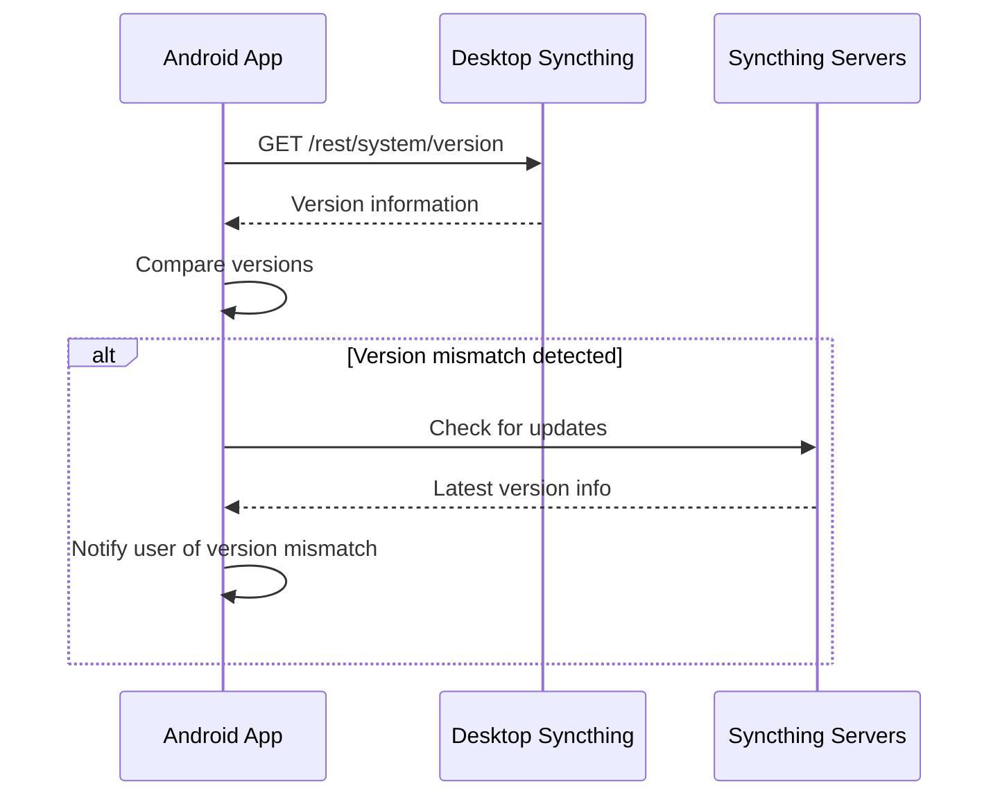

# Keeping the Android App Updated with the Desktop Version

## 1. Overview

This document outlines a strategy to ensure the Syncthing Android application stays synchronized with the desktop version. The approach focuses on maintaining API compatibility, automating version checks, and implementing a seamless update mechanism for users.

The key challenge is to maintain synchronization between the desktop and mobile versions while respecting the "desktop-first development strategy" and ensuring that Android users have access to the latest features and security updates from the desktop version.

## 2. Current Architecture

### 2.1 Desktop Application
- Written in Go
- Exposes a REST API for remote management
- Version information available through `/rest/system/version` endpoint
- Upgrade capability through `/rest/system/upgrade` endpoint

### 2.2 Android Application
- Native Kotlin application
- Communicates with Syncthing backend via REST API
- Uses Retrofit for network communication
- Currently implements basic functionality through API calls

### 2.3 Shared Components
- API constants are shared through `lib/api/constants.go`
- Both applications use the same REST API endpoints

## 3. Proposed Solution

### 3.1 Automated Version Synchronization

#### 3.1.1 Version Checking Mechanism
The Android app will periodically check for version compatibility with the connected Syncthing instance:



#### 3.1.2 Implementation Details
1. Add version checking to the Android app's startup sequence
2. Implement periodic background checks (every 24 hours)
3. Create UI notifications for version mismatches
4. Provide links to download updated versions

### 3.2 API Compatibility Management

#### 3.2.1 Shared Constants Synchronization
Since API endpoints are already shared through `lib/api/constants.go`, we need to ensure:
- All new endpoints are added to this shared file
- Android app is updated to use new endpoints when they become available
- Backward compatibility is maintained for older Android versions

#### 3.2.2 API Versioning Strategy
Implement API versioning to handle compatibility:
- Add API version to endpoint responses
- Create compatibility matrix in Android app
- Gracefully degrade functionality for unsupported features

### 3.3 Continuous Integration Approach

#### 3.3.1 Automated Testing
- Create integration tests that verify Android app compatibility with desktop version
- Run tests against multiple versions of the desktop app
- Implement automated API contract testing

#### 3.3.2 Release Coordination
- Establish a release process that coordinates desktop and Android releases
- Use Git tags to mark compatible versions
- Create release notes that highlight Android-specific changes

## 4. Technical Implementation

### 4.1 Version Checking Service

#### 4.1.1 Android Service Implementation
```kotlin
class VersionCheckService {
    suspend fun checkVersionCompatibility(): VersionCompatibilityResult {
        // Get desktop version
        val desktopVersion = syncthingApiService.getVersion()
        
        // Get Android app version
        val androidVersion = getAppVersion()
        
        // Compare versions
        return compareVersions(desktopVersion, androidVersion)
    }
}
```

#### 4.1.2 Version Comparison Logic
- Parse semantic version strings
- Identify major/minor/patch differences
- Determine compatibility status
- Generate appropriate user notifications

### 4.2 API Endpoint Management

#### 4.2.1 Shared Constants Integration
Update the Android app to automatically consume constants from the shared file:
- Create a build process that extracts API endpoints from `lib/api/constants.go`
- Generate Android-compatible constants file during build
- Ensure all API calls use these shared constants

#### 4.2.2 Endpoint Discovery
Implement dynamic endpoint discovery:
```kotlin
interface SyncthingApiService {
    @GET("/rest/system/status")
    suspend fun getSystemStatus(@Header("X-API-Key") apiKey: String): SystemStatus
    
    @GET("/rest/system/version")
    suspend fun getVersion(@Header("X-API-Key") apiKey: String): SystemVersion
    
    // Dynamic endpoint discovery
    @GET("/rest/system/endpoints")
    suspend fun getAvailableEndpoints(@Header("X-API-Key") apiKey: String): List<ApiEndpoint>
}
```

### 4.3 User Experience Improvements

#### 4.3.1 Version Status Display
Add version information to the Android UI:
- Current desktop version
- Current Android app version
- Compatibility status indicator
- Update recommendation when needed

#### 4.3.2 Automatic Update Notifications
Implement notifications for:
- New desktop versions available
- Android app updates recommended
- Critical security updates
- Breaking API changes

## 5. Deployment Strategy

### 5.1 Release Process
1. Desktop version released first (following desktop-first strategy)
2. API changes documented in release notes
3. Android app updated to support new APIs
4. Android app released with compatibility for new desktop version
5. Both versions tagged with compatible version numbers

### 5.2 Backward Compatibility
- Maintain support for N-2 desktop versions
- Clearly document breaking changes
- Provide migration paths for users
- Implement graceful degradation for unsupported features

### 5.3 Testing Approach
- End-to-end tests with real Syncthing instances
- API contract verification tests
- Cross-version compatibility testing
- Automated UI testing for version-related features

## 6. Monitoring and Maintenance

### 6.1 Analytics
- Track version compatibility issues
- Monitor update adoption rates
- Identify common version mismatch scenarios
- Measure user engagement with update notifications

### 6.2 Error Handling
- Implement robust error handling for version checks
- Provide clear error messages to users
- Log version compatibility issues for debugging
- Create fallback mechanisms for API failures

### 6.3 Documentation
- Maintain updated API documentation
- Create developer guides for version synchronization
- Document troubleshooting steps for version issues
- Provide user guides for update processes

## 7. Security Considerations

### 7.1 Secure Communication
- Ensure all version checks use encrypted connections
- Validate server certificates
- Implement proper API key handling
- Protect against man-in-the-middle attacks

### 7.2 Update Verification
- Verify update package integrity
- Implement secure update delivery
- Validate version information from servers
- Protect against malicious update attempts

## 8. Performance Considerations

### 8.1 Network Efficiency
- Minimize version check frequency
- Cache version information locally
- Implement efficient polling strategies
- Use compression for version data

### 8.2 Resource Management
- Limit background processing for version checks
- Optimize memory usage for version comparison
- Implement battery-friendly scheduling
- Handle network failures gracefully

## 9. Future Enhancements

### 9.1 Automated Update Installation
- Implement automatic Android app updates
- Create seamless update experience
- Handle update failures gracefully
- Provide rollback capabilities

### 9.2 Advanced Compatibility Features
- Predictive compatibility checking
- Smart feature enablement based on version support
- User preference-based feature filtering
- Dynamic UI adaptation based on API availability